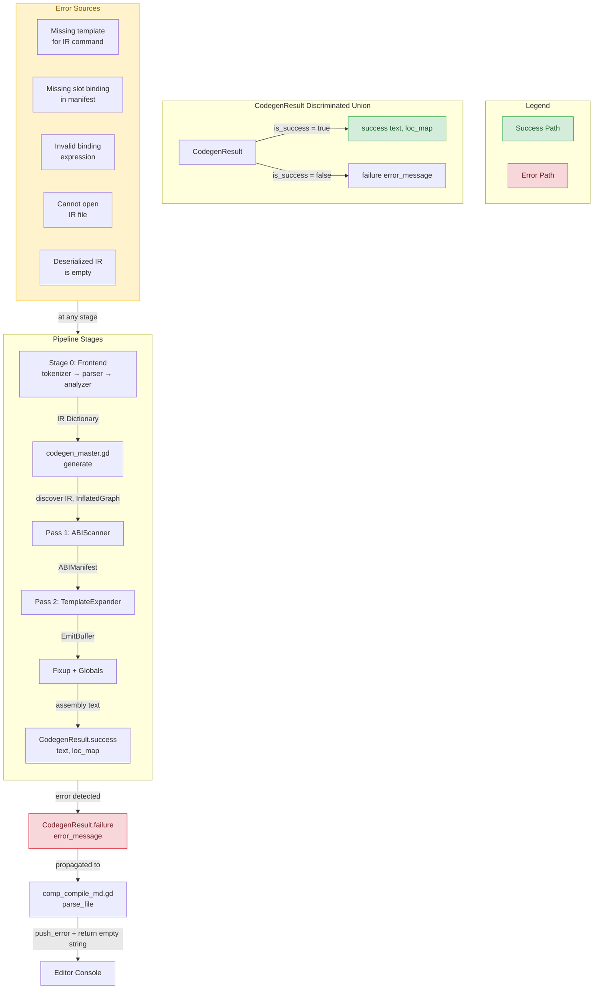
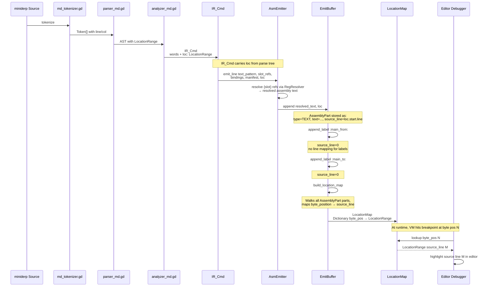
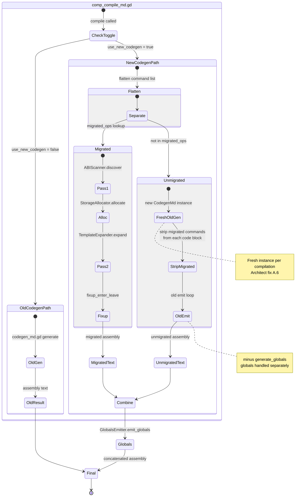
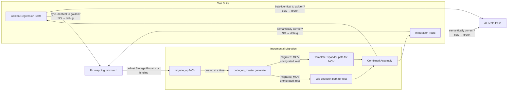
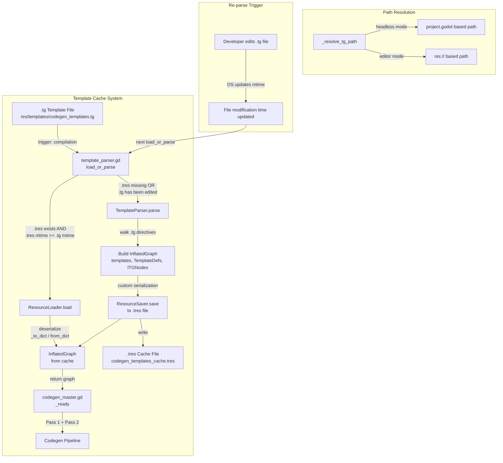

# Cross-Cutting Concerns Diagram

**Source**: [`plans/diagram_spec.md`](../plans/diagram_spec.md) Section 5  
**Date**: 2026-06-28  
**Purpose**: Document the four cross-cutting concerns that span the entire codegen pipeline — error handling, location tracking, incremental migration, and caching — plus a complete file/system inventory.

---

## Table of Contents

1. [Error Handling — CodegenResult Discriminated Union](#1-error-handling--codegenresult-discriminated-union)
2. [Location Tracking — Source Line Mapping for Debugger](#2-location-tracking--source-line-mapping-for-debugger)
3. [Incremental Migration — Old Codegen Fallback](#3-incremental-migration--old-codegen-fallback)
4. [Caching — InflatedGraph .tres Cache](#4-caching--inflatedgraph-tres-cache)
5. [File/System Inventory](#5-filesystem-inventory)

---

## 1. Error Handling — CodegenResult Discriminated Union

### 1.1 Mermaid Flowchart: Error Flow Through Pipeline

### 1.2 Error Handling Specification

| Aspect | Details |
|--------|---------|
| **Type** | Discriminated union — `is_success: bool` separates success from failure |
| **Factory methods** | [`CodegenResult.success(text, loc_map)`](../scenes/codegen_result.gd) and [`CodegenResult.failure(error_message)`](../scenes/codegen_result.gd) |
| **Success payload** | `text` (assembly String), `loc_map` (LocationMap for debugger) |
| **Failure payload** | `error_message` (String) — no assembly text produced |
| **Propagation** | [`codegen_master.gd:generate()`](../scenes/codegen_master.gd:129) returns `CodegenResult`; [`parse_file()`](../scenes/comp_codegen_new.gd) unwraps it and returns `""` on failure with `push_error()` |
| **Error sources** | Missing template for IR command, missing slot binding in manifest, invalid binding expression, cannot open IR file, deserialized IR is empty |

---

## 2. Location Tracking — Source Line Mapping for Debugger

### 2.1 Mermaid Sequence Diagram: Location Data Flow

### 2.2 Location Tracking Specification

| Aspect | Details |
|--------|---------|
| **Source tracking** | Each [`IR_Cmd`](../class_IR_cmd.gd) carries a `loc: LocationRange` from the parser/analyzer |
| **Emit side** | [`AsmEmitter.emit_line()`](../scenes/asm_emit.gd) passes the command's `loc` to [`EmitBuffer.append(text, loc)`](../scenes/codegen_result.gd) |
| **AssemblyPart** | Each part stores `source_line: int` — a reference back to the source line number |
| **LocationMap build** | [`EmitBuffer.build_location_map()`](../scenes/codegen_result.gd) walks all parts and builds a [`LocationMap`](../class_LocationMap.gd) mapping byte positions in the final text back to source locations |
| **Consumer** | The editor's debugger/highlight feature uses the LocationMap to highlight source lines when the VM hits a breakpoint |
| **Tightness** | Each EMIT_LINE node produces one AssemblyPart with a line mapping; labels, comments, and markers get `source_line = 0` (no mapping) |
| **Key classes** | [`class_Location.gd`](../class_Location.gd) (line/column), [`class_LocationRange.gd`](../class_LocationRange.gd) (range), [`class_LocationMap.gd`](../class_LocationMap.gd) (byte-to-source map) |

---

## 3. Incremental Migration — Old Codegen Fallback

### 3.1 Mermaid State Diagram: Migration Dispatcher

### 3.2 Migration Architecture Details

| Aspect | Details |
|--------|---------|
| **Toggle** | `comp_compile_md.gd:use_new_codegen` (default: `true`) |
| **migrated_ops** | [`codegen_master.gd:migrated_ops`](../scenes/codegen_master.gd) — Dictionary of all 13 IR commands currently all migrated: MOV, OP, IF, ELSE_IF, ELSE, WHILE, CALL, CALL_INDIRECT, RETURN, ENTER, LEAVE, ALLOC, MOV_ARR |
| **Dual-path** | `codegen_master.generate()` separates the flat command list into `migrated` and `unmigrated` arrays based on `migrated_ops` |
| **Migrated path** | Pass 2 template expansion via `TemplateExpander.expand()` |
| **Unmigrated path** | Fresh old-codegen instance (`CodegenMd.new()`) with migrated commands stripped from each code block, runs old emit loop minus `generate_globals()` |
| **Combination** | Migrated text + unmigrated text + globals section are concatenated |
| **Architect fix A.6** | Fresh old-codegen instance per compilation to prevent state corruption |
| **`migrate_op()`** | Method to mark ops as migrated at runtime (used by tests) |

### 3.3 How the System Stays Green During Migration

**Key principle**: Each command is migrated one at a time. The old codegen handles all unmigrated commands while the new pipeline handles migrated ones. Golden-file regression tests verify byte-identical output for every migrated command, so the system stays green throughout the migration.

---

## 4. Caching — InflatedGraph .tres Cache

### 4.1 Mermaid Flowchart: Cache Lifecycle

### 4.2 Caching Specification

| Aspect | Details |
|--------|---------|
| **Mechanism** | [`template_parser.gd:load_or_parse()`](../scenes/template_parser.gd) |
| **Cache file** | `.tg` + `_cache.tres` suffix (e.g. `codegen_templates.tg` → `codegen_templates_cache.tres`) |
| **Cache validation** | Timestamp comparison — if `.tres` modification time >= `.tg` modification time, load from cache |
| **Cache format** | Godot `.tres` Resource file — uses custom `_to_dict()` / `from_dict()` serialization since inner classes are not Resources |
| **First load** | Parse `.tg` → InflatedGraph → `ResourceSaver.save()` → return graph |
| **Subsequent loads** | `ResourceLoader.load()` → return cached graph (no parsing) |
| **Re-parse trigger** | Editing the `.tg` file updates its modification time, forcing a re-parse on next compilation |
| **Path resolution** | Multiple strategies for headless vs editor mode path differences ([`_resolve_tg_path()`](../scenes/template_parser.gd)) |
| **Cache format detail** | Custom `_to_dict()`/`from_dict()` handles [`InflatedGraph`](../scenes/inflated_template_graph.gd), [`TemplateDef`](../scenes/inflated_template_graph.gd), [`SlotDef`](../scenes/inflated_template_graph.gd), and all 8 [`ITGNode`](../scenes/inflated_template_graph.gd) subclass types |

---

## 5. File/System Inventory

### 5.1 Orchestration Layer

| File | Class Name | Type | Lines | Purpose |
|------|-----------|------|-------|---------|
| [`scenes/comp_compile_md.gd`](../scenes/comp_compile_md.gd) | `CompCompileMd` | NEW | — | Integration point — the compiler entry that chains Tokenizer → Parser → Analyzer → Codegen. Contains the `use_new_codegen` toggle |
| [`scenes/comp_codegen_new.gd`](../scenes/comp_codegen_new.gd) | `CompCodegenNew` | NEW | — | Scene-tree wrapper that hosts `CodegenMaster` as a child node and provides drop-in `parse_file()` / `fixup_symtable()` API |
| [`scenes/codegen_master.gd`](../scenes/codegen_master.gd) | `CodegenMaster` | NEW | — | Pipeline orchestrator — wires Pass 1 ABI Scanner + Pass 2 Template Expander, manages migrated/unmigrated command dispatch, appends globals section |
| [`scenes/codegen_md.gd`](../scenes/codegen_md.gd) | `CodegenMd` | MODIFIED | — | OLD codegen — kept as fallback for unmigrated commands. Referenced by CodegenMaster for deserialization and fallback emit |

### 5.2 Pass 1 — Declarative Discovery

| File | Class Name | Type | Lines | Purpose |
|------|-----------|------|-------|---------|
| [`scenes/abi_scanner.gd`](../scenes/abi_scanner.gd) | `ABIScanner` | NEW | — | Pass 1 entry point. Walks IR scopes for symbol declarations, walks each IR command's matched template body to discover temps/labels/imms/callbacks, then calls StorageAllocator |
| [`scenes/stor_alloc.gd`](../scenes/stor_alloc.gd) | `StorageAllocator` | EXISTING | — | Allocates concrete storage positions for all symbols (stack offsets), temporaries (round-robin registers EAX/EBX/ECX/EDX with stack spill), and immediates. Mirrors old codegen positions for golden-file compatibility |
| [`scenes/ab_manifest.gd`](../scenes/ab_manifest.gd) | `ABIManifest` | NEW | — | Pass 1 output data structure. Holds `symbols` Dictionary (ir_name → SymbolInfo), `labels` Dictionary (meta_name → generated_name), `temps` Array[TempSlot], `scope_stack_sizes`, `reachable_cbs` |

### 5.3 Pass 2 — Imperative Expansion

| File | Class Name | Type | Lines | Purpose |
|------|-----------|------|-------|---------|
| [`scenes/tmpl_expand.gd`](../scenes/tmpl_expand.gd) | `TemplateExpander` | NEW | — | Pass 2 entry point. Iterates flat command list, looks up each command's template in the InflatedGraph, walks the template body nodes, delegates EMIT_LINE to AsmEmitter, handles FOREACH/VARIANT/CALLBACK/LABEL/IF nodes |
| [`scenes/asm_emit.gd`](../scenes/asm_emit.gd) | `AsmEmitter` | NEW | — | Resolves `{slot_name}` references in emitted text patterns using RegResolver, appends resolved lines to EmitBuffer with location tracking. Also performs ENTER/LEAVE fixup |
| [`scenes/reg_resolve.gd`](../scenes/reg_resolve.gd) | `RegResolver` | EXISTING | — | Stateless resolver that maps value/temp names to concrete assembly text (register names, stack offsets `EBP[N]`, global dereferences `*name`, immediate literals) based on the pre-allocated ABIManifest |
| [`scenes/globals_emit.gd`](../scenes/globals_emit.gd) | `GlobalsEmitter` | NEW | — | Walks ABIManifest symbols and emits DB/ALLOC directives for all global-storage symbols (variables, arrays, string immediates). Mirrors old `generate_globals()` |
| [`scenes/codegen_result.gd`](../scenes/codegen_result.gd) | `CodegenResult`, `EmitBuffer` | NEW | — | Pipeline result type (success/failure discriminated union). Also contains the EmitBuffer inner class — a typed collector of AssemblyPart records that supports delayed stringification, location-map building, and post-processing fixup |

### 5.4 Template Engine

| File | Class Name | Type | Lines | Purpose |
|------|-----------|------|-------|---------|
| [`scenes/template_parser.gd`](../scenes/template_parser.gd) | `TemplateParser` | NEW | — | Parses `.tg` template files into InflatedGraph. Handles @template, @bind, @temp, @label, @new_imm, @variant, @emit_cb, for/endfor, if/endif. Implements timestamp-based `.tres` caching |
| [`scenes/inflated_template_graph.gd`](../scenes/inflated_template_graph.gd) | `InflatedGraph` | NEW | — | Data model — extends Resource for .tres serialization. Contains `TemplateDef`, `SlotDef`, `ITGNode` + 8 subclasses (EmitLineNode, ForEachNode, VariantSwitchNode, CallbackNode, TempAllocNode, LabelDefNode, ImmDefNode, BindingNode), plus `SlotRef` with Role enum |
| [`res/templates/codegen_templates.tg`](../res/templates/codegen_templates.tg) | — (source file) | NEW | — | Template source file — human-readable assembly-like format defining the mapping from all 13 IR commands to ZVM assembly. Pre-processed at build time |

### 5.5 Frontend (Stage 0)

| File | Class Name | Type | Lines | Purpose |
|------|-----------|------|-------|---------|
| [`scenes/md_tokenizer.gd`](../scenes/md_tokenizer.gd) | `MdTokenizer` | UNCHANGED | — | Lexical analysis — converts miniderp source text to Token stream |
| [`scenes/parser_md.gd`](../scenes/parser_md.gd) | `ParserMd` | UNCHANGED | — | Grammar-driven parse — converts Token stream to AST |
| [`scenes/analyzer_md.gd`](../scenes/analyzer_md.gd) | `AnalyzerMd` | UNCHANGED | — | Semantic analysis — converts AST to IR Dictionary with scopes and code blocks |

### 5.6 Supporting Data Classes

| File | Class Name | Type | Lines | Purpose |
|------|-----------|------|-------|---------|
| [`scenes/ir_md.gd`](../scenes/ir_md.gd) | `IRMd` | UNCHANGED | — | IR definition — the intermediate representation produced by the analyzer and consumed by codegen |
| [`class_IR_cmd.gd`](../class_IR_cmd.gd) | `IR_Cmd` | UNCHANGED | — | One command in the IR with `words` Array and `loc` LocationRange |
| [`class_Token.gd`](../class_Token.gd) | `Token` | UNCHANGED | — | Token data structure from tokenizer |
| [`class_Location.gd`](../class_Location.gd) | `Location` | UNCHANGED | — | Source location tracking (line/column) |
| [`class_LocationRange.gd`](../class_LocationRange.gd) | `LocationRange` | UNCHANGED | — | Range of source locations |
| [`class_LocationMap.gd`](../class_LocationMap.gd) | `LocationMap` | UNCHANGED | — | Maps assembly byte positions back to source locations for the debugger |
| [`class_Iter.gd`](../class_Iter.gd) | `Iter` | UNCHANGED | — | Iterator utility class used across the pipeline |
| [`class_ErrorReporter.gd`](../class_ErrorReporter.gd) | `ErrorReporter` | UNCHANGED | — | Error reporting utility for diagnostic messages |
| [`class_AssyBlock.gd`](../class_AssyBlock.gd) | `AssyBlock` | UNCHANGED | — | Assembly block data structure |

### 5.7 Assembler and VM

| File | Class Name | Type | Lines | Purpose |
|------|-----------|------|-------|---------|
| [`scenes/comp_asm_zd.gd`](../scenes/comp_asm_zd.gd) | `CompAsmZd` | UNCHANGED | — | Assembler — converts final assembly text to binary and uploads to VM |

---

## Summary

| File | Type Count |
|------|-----------|
| **NEW** | 12 files (orchestration 3 + Pass 1 2 + Pass 2 3 + template engine 3 + template source 1) |
| **MODIFIED** | 1 file (old codegen fallback) |
| **EXISTING/UNCHANGED** | 15 files (frontend 3 + supporting data 8 + assembler 1 + storage/existing 3) |
| **Total** | 28 files in the codegen system |

### Key Metrics

| Metric | Value |
|--------|-------|
| Total IR commands migrated | 13 of 13 (MOV, OP, IF, ELSE_IF, ELSE, WHILE, CALL, CALL_INDIRECT, RETURN, ENTER, LEAVE, ALLOC, MOV_ARR) |
| Migration status | All migrated — unmigrated fallback path exists but is unused |
| Cache strategy | Timestamp-based `.tres` cache with `_to_dict()`/`from_dict()` serialization |
| Error handling | Discriminated union `CodegenResult` with `is_success` flag |
| Location tracking | Byte position → source line via `LocationMap` built from `EmitBuffer` parts |
