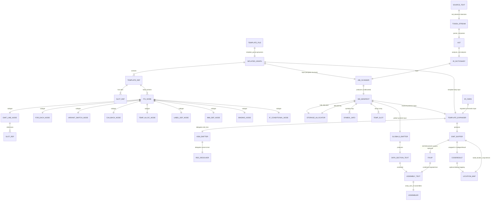

# Data Model & Relationships Diagram

> **Source**: [`plans/diagram_spec.md`](plans/diagram_spec.md) sections 5 and 7  
> **Purpose**: Document all key data structures in the new template-driven codegen pipeline, their relationships, and how they connect to pipeline stages.

---

## 1. Mermaid Class Diagram — All Key Data Structures

```mermaid
classDiagram
    class InflatedGraph {
        +Dictionary~String, TemplateDef~ templates
        +int version
        +to_dict() Dictionary
        +from_dict(data) void
    }

    class TemplateDef {
        +String name
        +Array~String~ param_variants
        +Array~SlotDef~ slots
        +Array~ITGNode~ body
    }

    class SlotDef {
        +String name
        +SlotType type
        +String binding
    }

    class SlotType {
        <<enumeration>>
        LOAD
        STORE
        ADDR
        VARIADIC
        CODEBLOCK
        LABEL
        OPTIONAL
        IMMEDIATE
    }

    class ITGNode {
        <<abstract>>
        +NodeType type
    }

    class NodeType {
        <<enumeration>>
        EMIT_LINE
        FOREACH
        IF_CONDITIONAL
        VARIANT_SWITCH
        CALLBACK
        TEMP_ALLOC
        LABEL_DEF
        IMM_DEF
        BINDING
    }

    class EmitLineNode {
        +String text_pattern
        +Array~SlotRef~ slot_refs
    }

    class SlotRef {
        +String slot_name
        +Role role
    }

    class Role {
        <<enumeration>>
        LOAD_REF
        STORE_REF
        ADDR_REF
        LABEL_REF
        VALUE_REF
        TEMP_REF
        IMM_REF
        CONTEXT_REF
        COMPUTED_REF
    }

    class ForEachNode {
        +String list_name
        +String element_name
        +Array~ITGNode~ body
    }

    class IfConditionalNode {
        +String slot_name
        +Array~ITGNode~ body
    }

    class VariantSwitchNode {
        +String slot_name
        +Dictionary~String, Array~ITGNode~~ variants
    }

    class CallbackNode {
        +String callback_name
        +Array~String~ arg_names
    }

    class TempAllocNode {
        +Array~String~ temp_names
    }

    class LabelDefNode {
        +Array~String~ label_names
    }

    class ImmDefNode {
        +String imm_name
        +int value
    }

    class BindingNode {
        +String slot_name
        +String binding_expression
    }

    class ABIManifest {
        +Dictionary~String, SymbolInfo~ symbols
        +Dictionary~String, String~ labels
        +Array~TempSlot~ temps
        +Dictionary~String, int~ scope_stack_sizes
        +Array~String~ reachable_cbs
        +Dictionary~String, Array~SlotRef~~ template_slot_refs
    }

    class SymbolInfo {
        +String ir_name
        +String val_type
        +String storage_type
        +int storage_pos
        +String data_type
        +bool is_array
        +int array_size
        +bool needs_deref
        +String scope
    }

    class TempSlot {
        +String name
        +String preferred_register
        +int stack_pos
    }

    class CodegenResult {
        +bool is_success
        +String text
        +String error_message
        +LocationMap loc_map
        +factory success(text, loc_map)
        +factory failure(error_message)
    }

    class EmitBuffer {
        +Array~AssemblyPart~ parts
        +Dictionary~int, LocationRange~ location_map
        +int byte_pos
        +append(text, loc) void
        +append_label(text) void
        +append_location_marker(line) void
        +to_text() String
        +build_location_map() LocationMap
    }

    class AssemblyPart {
        +AssemblyPartType type
        +String text
        +int source_line
    }

    class AssemblyPartType {
        <<enumeration>>
        TEXT
        LABEL
        LOCATION_MARKER
    }

    class LocationMap {
        +Dictionary~int, LocationRange~ mapping
    }

    class LocationRange {
        +Location start
        +Location end
    }

    %% Inheritance hierarchy: ITGNode subtypes
    ITGNode <|-- EmitLineNode
    ITGNode <|-- ForEachNode
    ITGNode <|-- IfConditionalNode
    ITGNode <|-- VariantSwitchNode
    ITGNode <|-- CallbackNode
    ITGNode <|-- TempAllocNode
    ITGNode <|-- LabelDefNode
    ITGNode <|-- ImmDefNode
    ITGNode <|-- BindingNode

    %% Composition relationships
    InflatedGraph *-- TemplateDef : contains many
    TemplateDef *-- SlotDef : has many
    TemplateDef *-- ITGNode : body has many
    EmitLineNode *-- SlotRef : has many
    ABIManifest *-- SymbolInfo : contains many
    ABIManifest *-- TempSlot : contains many
    CodegenResult *-- EmitBuffer : contains
    EmitBuffer *-- AssemblyPart : contains many
    CodegenResult *-- LocationMap : optional

    %% Enum associations
    SlotDef --> SlotType
    ITGNode --> NodeType
    SlotRef --> Role
    AssemblyPart --> AssemblyPartType
```



---

## 2. Mermaid Entity Relationship Diagram — Pipeline Stages vs Data Structures



### Pipeline Stage to Entity Mapping

| Pipeline Stage | Primary Producer | Primary Consumer | Key Data Structures |
|---|---|---|---|
| **Pre-Build** | `template_parser.gd` | `.tres` cache | InflatedGraph, TemplateDef, SlotDef, ITGNode subtypes |
| **Stage 0: Frontend** | `md_tokenizer`, `parser_md`, `analyzer_md` | `codegen_master.gd` | Token[], AST, IR Dictionary |
| **Stage 1: Pass 1** | `ABIScanner` | `StorageAllocator` | ABIManifest (unallocated) |
| **Stage 1b: Storage** | `StorageAllocator` | Pass 2 | ABIManifest (allocated), SymbolInfo, TempSlot |
| **Stage 2: Pass 2** | `TemplateExpander` + `AsmEmitter` | Fixup | EmitBuffer, AssemblyPart |
| **Stage 2b: Fixup** | `AsmEmitter.fixup_enter_leave` | Stringify | EmitBuffer (modified) |
| **Stage 2b: Globals** | `GlobalsEmitter` | Assembly concatenation | Assembly text |
| **Stage 3: Assembler** | `comp_asm_zd.gd` | VM | Binary program |

---

## 3. Enum Reference Tables

### 3.1 SlotDef.SlotType

Defines the role of a template parameter slot. Used during template parsing and slot-reference resolution.

| Value | Description | Resolution Behavior | Example |
|---|---|---|---|
| `LOAD` | Value is read from | Resolves to value-read syntax (`*x`, `EBP[-4]`) | Source operand |
| `STORE` | Value is written to | Resolves to value-write syntax (`*x`, `EBP[-4]`) | Destination operand |
| `ADDR` | Address of value is needed | Resolves to address syntax (`x`, `EBP+12`) | CALL target |
| `VARIADIC` | Accepts zero or more arguments | Resolves to verbatim word via `VALUE_REF` | Variable arg list |
| `CODEBLOCK` | References a code block by name | Resolves to verbatim name via `VALUE_REF` | `@emit_cb(name)` |
| `LABEL` | Slot is a label reference | Resolves to plain label name via `LABEL_REF` | Branch target |
| `OPTIONAL` | Slot may be empty | Resolves to verbatim word or empty via `VALUE_REF` | Optional operand |
| `IMMEDIATE` | Slot is an immediate constant | Resolves to literal value via `IMM_REF` | Numeric literal |

### 3.2 ITGNode.NodeType

Defines the type discriminator for each node in a template body. Used for dispatch in both Pass 1 (scanning) and Pass 2 (expansion).

| Value | Class | Pass 1 Behavior | Pass 2 Behavior |
|---|---|---|---|
| `EMIT_LINE` | EmitLineNode | Scan slot refs (no-op for refs, but needed for structural walking) | Call `AsmEmitter.emit_line()` with resolved `{slot}` patterns |
| `FOREACH` | ForEachNode | Recursively scan sub-body | Iterate variadic list, recurse body per element with scoped bindings |
| `IF_CONDITIONAL` | IfConditionalNode | Recursively scan sub-body | Conditionally emit body if slot is present/non-empty |
| `VARIANT_SWITCH` | VariantSwitchNode | Recursively scan ALL variant bodies (emit-time variant unknown) | Dispatch on slot value, recurse matching variant body |
| `CALLBACK` | CallbackNode | Dispatch on `callback_name`: `ref_cb`→mark reachable, `needs_deref`→set flag, `reverse`→skip | Dispatch on `callback_name`: `emit_cb`→recursively expand code block, `reverse`→reverse list |
| `TEMP_ALLOC` | TempAllocNode | Add TempSlot entries to ABIManifest | No-op (handled in Pass 1) |
| `LABEL_DEF` | LabelDefNode | Generate unique label name, store in manifest | Emit label name from manifest |
| `IMM_DEF` | ImmDefNode | Add immediate SymbolInfo to manifest | No-op (handled in Pass 1) |
| `BINDING` | BindingNode | Extract binding expression for slot-value mapping | No-op (handled in Pass 1) |

### 3.3 SlotRef.Role

Defines how a `{slot}` reference inside an emit-line text pattern is resolved at emit time.

| Value | Resolution Strategy | Example Input | Example Output |
|---|---|---|---|
| `LOAD_REF` | Resolve via `RegResolver.resolve_value(name, manifest, "load")` — uses storage type to determine read syntax | `{src}` with global var `x` | `*x` |
| `STORE_REF` | Resolve via `RegResolver.resolve_value(name, manifest, "store")` — uses storage type to determine write syntax | `{dest}` with global var `x` | `*x` |
| `ADDR_REF` | Resolve via `RegResolver.resolve_value(name, manifest, "addr")` — returns address syntax without dereference | `{target}` with global var `x` | `x` |
| `LABEL_REF` | Lookup `manifest.labels[name]` for generated label name | `{else_lbl}` → `"lbl_else"` | `lbl_1__lbl_else` |
| `VALUE_REF` | Return verbatim binding value (no transformation) | `{op}` → `"ADD"` | `ADD` |
| `TEMP_REF` | Resolve via `RegResolver.resolve_temp(name, manifest)` — returns register name or stack spill syntax | `{tmp_a}` allocated to EAX | `EAX` |
| `IMM_REF` | Resolve via `RegResolver.resolve_imm(name, manifest)` — returns literal value from SymbolInfo | `{imm_42}` | `42` |
| `CONTEXT_REF` | Prefixed with `%` — return verbatim context variable value from bindings | `{%if_block_lbl_end}` | `lbl_2__if_end` |
| `COMPUTED_REF` | Prefixed with `len(...)` — return length of a variadic list | `{len(args)}` | `3` |

**Role Resolution Priority** (as implemented in `SlotRef` resolver):

1. Prefix check: `{% name}` → `CONTEXT_REF`; `{len(...)}` → `COMPUTED_REF`
2. Slot type match: if name matches a `SlotDef`, its `SlotType` determines the role (LOAD→`LOAD_REF`, STORE→`STORE_REF`, ADDR→`ADDR_REF`, LABEL→`LABEL_REF`, others→`VALUE_REF`)
3. Naming convention: `tmp_*` prefix → `TEMP_REF`; `imm_*` prefix → `IMM_REF`
4. Known names set → `VALUE_REF`
5. Fallback → `VALUE_REF`

### 3.4 AssemblyPartType

Defines the type of each record in the EmitBuffer's typed assembly-part collection.

| Value | Description | `source_line` Behavior | Example |
|---|---|---|---|
| `TEXT` | A regular assembly text line with optional source mapping | Set to source line number from IR_Cmd.loc | `mov *x, *y;\n` |
| `LABEL` | An assembly label definition | Always `0` (no source mapping) | `:main_from:\n` |
| `LOCATION_MARKER` | A synthetic marker for location tracking | Set to arbitrary line for tracking | `# Begin code block main\n` |

**AssemblyPart Lifecycle**:

```
TemplateExpander creates AssemblyPart.TEXT records
     │
     ▼
AsmEmitter.append() adds with source_line from IR_Cmd.loc
     │
     ▼
fixup_enter_leave() modifies AssemblyPart.TEXT.text in-place
     │
     ▼
EmitBuffer.build_location_map() walks all parts
     │
     ▼
LocationMap built: byte_pos → LocationRange
     │
     ▼
EmitBuffer.to_text() concatenates all AssemblyPart.text values
```

---

## Appendix: Storage Resolution Reference

How `RegResolver` maps each `storage_type` to assembly text, depending on the role:

| storage_type | Role LOAD_REF/STORE_REF | Role ADDR_REF | Role VALUE_REF |
|---|---|---|---|
| `global` | `*name` | `name` | `name` |
| `stack` | `EBP[-N]` | `EBP-N` | `EBP-N` |
| `register` | EAX/EBX/ECX/EDX | EAX/EBX/ECX/EDX | register name |
| `immediate` | literal value | literal value | literal value |
| `code` | label name | label name | label name |
| `extern` | `*name` | `name` | `name` |

---

*Generated from [`plans/diagram_spec.md`](plans/diagram_spec.md) sections 5 and 7. For pipeline flow diagrams, see [`docs/diagram_pipeline_flow.md`](docs/diagram_pipeline_flow.md).*
