# Pipeline & Data Flow Diagram

**Document**: Pipeline stages, data formats, and migration dispatcher for the CpuDerp codegen architecture.  
**Source**: [`plans/diagram_spec.md`](../plans/diagram_spec.md) Sections 2 & 3  
**Date**: 2026-06-28

---

## 1. Complete Pipeline Flowchart

```mermaid
flowchart TB
    subgraph PreBuild["Pre-Build Time (once per template edit)"]
        direction TB
        TG[".tg Template File<br/>res/templates/codegen_templates.tg"] -->|"template_parser.gd<br/>load_or_parse"| TP["TemplateParser<br/>parse"]
        TP -->|"compile .tg → InflatedGraph"| IG["InflatedGraph<br/>Resource"]
        IG -->|"ResourceSaver.save"| Cache[".tres Cache<br/>on disk"]
        Cache -.->|"loaded next launch if .tg unchanged"| IG
    end

    subgraph CompileTime["Compile Time (per compilation)"]
        direction TB

        subgraph Stage0["Stage 0: Frontend"]
            SRC["miniderp source<br/>.md files"] -->|"md_tokenizer.gd<br/>tokenize"| TK["Tokenizer"]
            TK -->|"Token[]"| PR["Parser<br/>parser_md.gd"]
            PR -->|"parse"| AST["AST"]
            AST -->|"analyze"| AN["Analyzer<br/>analyzer_md.gd"]
            AN -->|"IR Dictionary<br/>{ scopes, code_blocks, strings }"| CM
        end

        subgraph Stage1["Stage 1: Pass 1 — ABI Discovery"]
            CM["codegen_master.gd<br/>generate"] -->|"discover IR, InflatedGraph"| AS["ABIScanner<br/>discover"]
            AS -->|"unallocated manifest"| SA["StorageAllocator<br/>allocate"]
            IG -.->|"template structure"| AS
        end

        subgraph Stage1b["Stage 1b: Storage Allocation"]
            SA -->|"scope walk + temp alloc + imm alloc"| AM["ABIManifest<br/>fully allocated"]
        end

        AM -->|"symbols, labels, temps, stack sizes"| SPLIT{"Migration<br/>Dispatcher"}

        subgraph Stage2["Stage 2: Pass 2 — Template Expansion"]
            direction TB
            SPLIT -->|"migrated commands"| TE["TemplateExpander<br/>expand"]
            IG -.->|"template body"| TE
            AM -.->|"resolved positions"| TE
            TE -->|"walk template body nodes<br/>EMIT_LINE / FOREACH / VARIANT / CALLBACK / etc."| AE["AsmEmitter<br/>emit_line"]
            AE -->|"resolve {slot} refs via RegResolver"| EB["EmitBuffer<br/>AssemblyPart records"]
        end

        subgraph Stage2b["Stage 2b: Fixup + Globals"]
            EB -->|"ENTER/LEAVE placeholders"| FX["Fixup ENTER/LEAVE<br/>asm_emit.gd"]
            FX -->|"sub ESP ± N"| EB_FIXED["EmitBuffer<br/>fixed"]
            AM -->|"global symbols"| GE["GlobalsEmitter<br/>emit_globals"]
            GE -->|"DB / ALLOC directives"| DS["Data Section<br/>Assembly text"]
        end

        subgraph OldPath["Old Codegen Fallback"]
            SPLIT -->|"unmigrated commands"| OC["codegen_md.gd<br/>old emit loop<br/>fresh instance per compile"]
            OC -->|"assembly text"| OLD_TEXT["Unmigrated Assembly<br/>sans globals"]
        end

        EB_FIXED -->|"to_text"| ST["Assembly text<br/>migrated"]
        ST --> COMBINE["Combine"]
        OLD_TEXT --> COMBINE
        DS --> COMBINE
        COMBINE --> FINAL_ASM["Final Assembly String<br/>.zd format"]
    end

    subgraph Stage3["Stage 3: Assembler + Upload"]
        FINAL_ASM -->|"comp_asm_zd.gd"| ASSM["Assembler<br/>comp_asm_zd.gd"]
        ASSM -->|"binary"| VM["VM Memory"]
    end

    subgraph Legend["Data Format Legend"]
        L1["▪ miniderp source — textual input .md files"]
        L2["▪ Token stream — Array[Token] from md_tokenizer.gd"]
        L3["▪ AST — Abstract Syntax Tree from parser_md.gd"]
        L4["▪ IR Dictionary — scoped intermediate representation"]
        L5["▪ IR_Cmd — one command: words Array + LocationRange"]
        L6["▪ .tg templates — assembly-like @directive file"]
        L7["▪ InflatedGraph — compiled template Resource"]
        L8["▪ ABIManifest — all symbols/labels/temps allocated"]
        L9["▪ EmitBuffer — typed AssemblyPart records"]
        L10["▪ Assembly text — final .zd format assembly string"]
        L11["▪ LocationMap — byte positions ↔ source lines"]
    end
```



---

## 2. Pipeline Stage Table

| Stage | Name | Input Format | Output Format | Key File | Entry Point Function |
|---|---|---|---|---|---|
| **Pre-Build** | Template Compilation | `.tg` template text | `InflatedGraph` (`.tres` Resource) | [`scenes/template_parser.gd`](../scenes/template_parser.gd) | `template_parser.gd:load_or_parse()` → `parse()` |
| **Stage 0** | Frontend | miniderp source (`.md`) | IR Dictionary `{ scopes, code_blocks, strings }` | [`scenes/comp_compile_md.gd`](../scenes/comp_compile_md.gd) | `comp_compile_md.gd:compile()` (chains tokenize → parse → analyze) |
| **Stage 1** | Pass 1 — ABI Discovery | IR Dictionary + InflatedGraph | `ABIManifest` (unallocated) | [`scenes/abi_scanner.gd`](../scenes/abi_scanner.gd) | `ABIScanner.discover(IR, graph)` at line 57 |
| **Stage 1b** | Storage Allocation | ABIManifest (unallocated) + IR | `ABIManifest` (fully allocated) | [`scenes/stor_alloc.gd`](../scenes/stor_alloc.gd) | `StorageAllocator.allocate()` |
| **Stage 2** | Pass 2 — Template Expansion | Flat `Array[IR_Cmd]` (migrated) + InflatedGraph + ABIManifest | `EmitBuffer` (typed AssemblyPart records) | [`scenes/tmpl_expand.gd`](../scenes/tmpl_expand.gd) | `TemplateExpander.expand()` at line 38 |
| **Stage 2b** | Fixup + Globals | EmitBuffer + ABIManifest | Modified EmitBuffer + Assembly text string | [`scenes/asm_emit.gd`](../scenes/asm_emit.gd) + [`scenes/globals_emit.gd`](../scenes/globals_emit.gd) | `AsmEmitter.fixup_enter_leave()` + `GlobalsEmitter.emit_globals()` |
| **Stage 3** | Assembler + Upload | Final assembly text (`.zd` format) | Binary program in VM memory | [`scenes/comp_asm_zd.gd`](../scenes/comp_asm_zd.gd) | `comp_asm_zd.gd:assemble()` |

---

## 3. Migration Dispatcher (Old vs New Codegen Split)

The migration dispatcher lives inside `codegen_master.gd:generate()` and controls which path each IR command takes.

### Dispatch Logic

```
Flat command list (all IR_Cmds)
        │
        ▼
  ┌─────────────────────────────┐
  │  Separate by migrated_ops   │
  │  Dictionary lookup on       │
  │  cmd.words[0] (opcode)      │
  └──────────┬──────────────────┘
             │
     ┌───────┴───────┐
     ▼               ▼
  migrated         unmigrated
     │               │
     ▼               ▼
  Pass 2:          Fresh old codegen
  TemplateExpander CodegenMd.new()
  .expand()        per compilation
     │               │
     │               +── migrated cmds
     │                   stripped from
     │                   each code block
     │               │
     ▼               ▼
  Assembly         Assembly
  (migrated)       (unmigrated, sans globals)
     │               │
     └───────┬───────┘
             ▼
      Combined + GlobalsEmitter.emit_globals()
             │
             ▼
      Final Assembly String
```

### Key Details

| Aspect | Detail |
|---|---|
| **Toggle** | `comp_compile_md.gd:use_new_codegen` (default: `true`) |
| **migrated_ops** | `codegen_master.gd:migrated_ops` — Dictionary of all 13 IR commands (all currently migrated) |
| **Migrated path** | Pass 2 template expansion via [`TemplateExpander.expand()`](../scenes/tmpl_expand.gd:38) |
| **Unmigrated path** | Fresh [`CodegenMd.new()`](../scenes/codegen_md.gd) instance per compilation with migrated commands stripped from each code block |
| **Globals** | Only new codegen emits globals (via `GlobalsEmitter`); old codegen fallback skips `generate_globals()` |
| **Architect fix A.6** | Fresh old-codegen instance per compilation to prevent state corruption |
| **`migrate_op()`** | Runtime method to mark ops as migrated (used by tests) |

### All 13 IR Commands

All are currently fully migrated:

`MOV`, `OP`, `IF`, `ELSE_IF`, `ELSE`, `WHILE`, `CALL`, `CALL_INDIRECT`, `RETURN`, `ENTER`, `LEAVE`, `ALLOC`, `MOV_ARR`

---

## 4. Data Format Legend

The pipeline processes 11 distinct data formats. Ordered by pipeline sequence:

| # | Format | Description | Producer | Consumer | Key Fields / Structure |
|---|---|---|---|---|---|
| 1 | **miniderp source** | Textual input language (`.md` files) | User / editor | [`md_tokenizer.gd`](../scenes/md_tokenizer.gd) | Plain text; user-written miniderp code |
| 2 | **Token stream** | `Array[Token]` — lexical tokens | [`md_tokenizer.gd`](../scenes/md_tokenizer.gd) | [`parser_md.gd`](../scenes/parser_md.gd) | Typed tokens with source location |
| 3 | **AST** | Abstract Syntax Tree | [`parser_md.gd`](../scenes/parser_md.gd) | [`analyzer_md.gd`](../scenes/analyzer_md.gd) | Grammar-driven tree structure |
| 4 | **IR Dictionary** | Dictionary `{ scopes, code_blocks, strings }` | [`analyzer_md.gd`](../scenes/analyzer_md.gd) | [`codegen_master.gd`](../scenes/codegen_master.gd) | Scopes contain vars/funcs; code_blocks map name → code with `Array[IR_Cmd]` |
| 5 | **IR_Cmd** | One command in the IR — `words: Array[String]` + `loc: LocationRange` | Extracted from IR code_blocks | Pass 1 + Pass 2 | `words[0]` = opcode (e.g. `"MOV"`); rest = operands; `loc` = source location |
| 6 | **.tg templates** | Textual template file — assembly-like with `@directives` | Hand-written in `res/templates/` | [`template_parser.gd`](../scenes/template_parser.gd) | `@template`, `@bind`, `@temp`, `@label`, `@variant`, `for/endfor`, etc. |
| 7 | **InflatedGraph** | Compiled template graph — `Dictionary{ template_name → TemplateDef }` | [`template_parser.gd`](../scenes/template_parser.gd) | `codegen_master` (cached as `.tres`) | Contains `TemplateDef` with `slots`, `body: Array[ITGNode]` (8 node subtypes) |
| 8 | **ABIManifest** | Pass 1 output — all symbols, labels, temps, scope sizes | [`abi_scanner.gd`](../scenes/abi_scanner.gd) + [`stor_alloc.gd`](../scenes/stor_alloc.gd) | Pass 2 (`tmpl_expand`, `asm_emit`, `globals_emit`) | `symbols: Dict{name → SymbolInfo}`, `labels`, `temps: Array[TempSlot]`, `scope_stack_sizes`, `reachable_cbs` |
| 9 | **EmitBuffer** | Typed `Array[AssemblyPart]` (TEXT / LABEL / LOCATION_MARKER) | [`tmpl_expand.gd`](../scenes/tmpl_expand.gd) + [`asm_emit.gd`](../scenes/asm_emit.gd) | `fixup_enter_leave()` → `to_text()` | Each part: `type`, `text`, `source_line`; supports `.append()`, `.to_text()`, `.build_location_map()` |
| 10 | **Assembly text** | Final zderp assembly string (`.zd` format) | [`codegen_result.gd`](../scenes/codegen_result.gd) → `to_text()` | [`comp_asm_zd.gd`](../scenes/comp_asm_zd.gd) (assembler) | Flat text with labels `:name:`, instructions `mov *x, *y;`, directives `db` / `ALLOC` |
| 11 | **LocationMap** | Maps byte positions in assembly → source lines for debugger | `EmitBuffer.build_location_map()` | Editor debugger / highlight | `Dictionary{ byte_pos → LocationRange }` |

---

## 5. Key File Index

| File | Role |
|---|---|
| [`scenes/comp_compile_md.gd`](../scenes/comp_compile_md.gd) | Integration entry — chains frontend + codegen; contains `use_new_codegen` toggle |
| [`scenes/comp_codegen_new.gd`](../scenes/comp_codegen_new.gd) | Scene-tree wrapper hosting `CodegenMaster` |
| [`scenes/codegen_master.gd`](../scenes/codegen_master.gd) | Pipeline orchestrator — Pass 1 + Pass 2 dispatch, migration split, globals append |
| [`scenes/abi_scanner.gd`](../scenes/abi_scanner.gd) | Pass 1 entry — walks IR + template bodies to discover symbols |
| [`scenes/stor_alloc.gd`](../scenes/stor_alloc.gd) | Storage allocation — assigns stack/register/global positions |
| [`scenes/ab_manifest.gd`](../scenes/ab_manifest.gd) | ABIManifest data structure (Pass 1 output) |
| [`scenes/tmpl_expand.gd`](../scenes/tmpl_expand.gd) | Pass 2 entry — walks template body nodes, delegates emit |
| [`scenes/asm_emit.gd`](../scenes/asm_emit.gd) | Resolves `{slot}` references, appends to EmitBuffer, ENTER/LEAVE fixup |
| [`scenes/reg_resolve.gd`](../scenes/reg_resolve.gd) | Stateless name-to-assembly-text resolver |
| [`scenes/globals_emit.gd`](../scenes/globals_emit.gd) | Emits DB/ALLOC directives for global symbols |
| [`scenes/codegen_result.gd`](../scenes/codegen_result.gd) | `CodegenResult` + `EmitBuffer` inner class |
| [`scenes/template_parser.gd`](../scenes/template_parser.gd) | Compiles `.tg` → `InflatedGraph` with `.tres` caching |
| [`scenes/inflated_template_graph.gd`](../scenes/inflated_template_graph.gd) | `InflatedGraph` data model (Resource) |
| [`scenes/codegen_md.gd`](../scenes/codegen_md.gd) | OLD codegen — fallback for unmigrated commands |
| [`res/templates/codegen_templates.tg`](../res/templates/codegen_templates.tg) | Template source file — all 13 command templates |
| [`scenes/comp_asm_zd.gd`](../scenes/comp_asm_zd.gd) | Assembler — text to binary |

---

## 6. Companion Diagrams

For additional architectural views, see the Mermaid diagram templates in [`plans/diagram_spec.md`](../plans/diagram_spec.md):

- **Sequence Diagram** (Appendix): End-to-end pipeline message flow
- **Two-Pass Architecture** (Appendix): Component relationships within Pass 1 and Pass 2
- **Template Body Node Dispatch** (Appendix): State machine for Pass 2 node walking
- **Pass 1 Discovery Flow** (Appendix): Detailed flowchart of ABI scanning
- **Data Model Relationships** (Section 7): UML-style hierarchy diagrams for InflatedGraph, ABIManifest, CodegenResult, and orchestration
