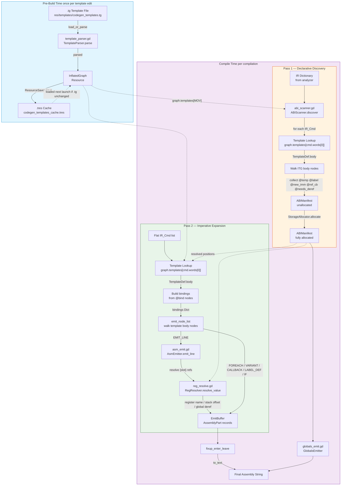

# Template Engine Architecture

**Date**: 2026-06-28  
**Source**: [`plans/diagram_spec.md`](plans/diagram_spec.md) Sections 4, 6  
**Purpose**: Document the template-driven codegen engine — how `.tg` template files are parsed into an `InflatedGraph`, cached, and consumed by both Pass 1 (ABI discovery) and Pass 2 (imperative expansion) of the codegen pipeline.

---

## Table of Contents

1. [Template Engine Flowchart](#1-template-engine-flowchart)
2. [Template Body Node Dispatch](#2-template-body-node-dispatch)
3. [Vertical Slice Trace: MOV Template](#3-vertical-slice-trace-mov-template)
4. [.tg Directives Reference Table](#4-tg-directives-reference-table)

---

## 1. Template Engine Flowchart

The Mermaid flowchart below shows the full lifecycle of a `.tg` template file: pre-build parsing and caching, then compile-time lookup and body walking for both passes.



### 1.1 Key Data Flow Summary

| Step | From | To | What Happens |
|---|---|---|---|
| 1 | `.tg` file | `template_parser.gd` | Text parsed into `TemplateDef` + `ITGNode[]` body |
| 2 | `template_parser.gd` | `InflatedGraph` | All templates collected into `Dictionary<String, TemplateDef>` |
| 3 | `InflatedGraph` | `.tres` cache | `ResourceSaver.save()` — timestamp-checked reload |
| 4 | `InflatedGraph` | `ABIScanner` (Pass 1) | Template body walked for declarative nodes (@temp, @label, etc.) |
| 5 | `InflatedGraph` | `TemplateExpander` (Pass 2) | Template body walked for imperative emit (EMIT_LINE, FOREACH, etc.) |
| 6 | `TemplateExpander` | `AsmEmitter` | `{slot}` references resolved via `RegResolver` against `ABIManifest` |
| 7 | `AsmEmitter` | `EmitBuffer` | Typed `AssemblyPart` records collected |
| 8 | `EmitBuffer` | Final assembly | Fixup → `to_text()` → combined with globals section |

---

## 2. Template Body Node Dispatch

This diagram shows how [`tmpl_expand.gd:emit_node_list()`](scenes/tmpl_expand.gd:90) dispatches each `ITGNode` type at emit time.

```mermaid
stateDiagram-v2
    state "emit_node_list for each template body" as Entry
    state "Match node.type" as Match
    state "EMIT_LINE" as EmitLine
    state "FOREACH" as ForEach
    state "VARIANT_SWITCH" as Variant
    state "CALLBACK" as Callback
    state "LABEL_DEF" as LabelDef
    state "IF_CONDITIONAL" as IfCond
    state "TEMP_ALLOC / IMM_DEF / BINDING" as Skip
    state "Next node in body" as Next
    state "All nodes done → next IR command" as Done

    [*] --> Entry
    Entry --> Match

    Match --> EmitLine: EMIT_LINE
    Match --> ForEach: FOREACH
    Match --> Variant: VARIANT_SWITCH
    Match --> Callback: CALLBACK
    Match --> LabelDef: LABEL_DEF
    Match --> IfCond: IF_CONDITIONAL
    Match --> Skip: TEMP_ALLOC
    Match --> Skip: IMM_DEF
    Match --> Skip: BINDING

    state EmitLineDetail["AsmEmitter.emit_line">
        EmitLine --> EmitLineDetail
        EmitLineDetail --> ReplaceRefs["Replace {slot} refs<br>via RegResolver"]
        ReplaceRefs --> AppendBuf["Append resolved line<br>to EmitBuffer"]
        AppendBuf --> Next
    ]

    state ForEachDetail["Iterate variadic list">
        ForEach --> ForEachDetail
        ForEachDetail --> ScopedBindings["Scoped bindings<br>per element"]
        ScopedBindings --> RecurseBody["Recurse emit_node_list<br>on for-body"]
        RecurseBody --> Next
    ]

    state VariantDetail["Dispatch on slot value">
        Variant --> VariantDetail
        VariantDetail --> MatchVariant["bindings[node.slot_name]<br>→ matches variant key"]
        MatchVariant --> RecurseVariant["Recurse emit_node_list<br>on variant body"]
        RecurseVariant --> Next
    ]

    state CallbackDetail["Dispatch on callback_name">
        Callback --> CallbackDetail
        CallbackDetail --> EmitCb: "emit_cb"
        CallbackDetail --> Reverse: "reverse"
        CallbackDetail --> RefCb: "ref_cb"
        CallbackDetail --> NeedsDeref: "needs_deref"

        EmitCb --> RecursiveExpand["Recursively expand<br>referenced code block"]
        RecursiveExpand --> Next

        Reverse --> ReverseList["Reverse variadic list<br>in-place in bindings"]
        ReverseList --> Next

        RefCb --> Pass1Only1["Pass 1 handled — no-op"]
        Pass1Only1 --> Next

        NeedsDeref --> Pass1Only2["Pass 1 handled — no-op"]
        Pass1Only2 --> Next
    ]

    state LabelDefDetail["Emit pre-generated label">
        LabelDef --> LabelDefDetail
        LabelDefDetail --> LookupLabel["manifest.labels[lbl_name]"]
        LookupLabel --> AppendLabel["buf.append_label"]
        AppendLabel --> Next
    ]

    state IfDetail["Conditional emission">
        IfCond --> IfDetail
        IfDetail --> CheckSlot["bindings[node.slot_name]<br>non-null and non-empty?"]
        CheckSlot --> RecurseIf: "yes"
        CheckSlot --> Next: "no"
        RecurseIf --> Next
    ]

    Skip --> Next
    Next --> Match: more nodes
    Next --> Done: no more nodes
    Done --> [*]
```

### 2.1 Dispatch Matrix

| `node.type` | Handler in [`tmpl_expand.gd`](scenes/tmpl_expand.gd) | Behavior at Pass 2 |
|---|---|---|
| `EMIT_LINE` | inline at [line 103](scenes/tmpl_expand.gd:103) | Delegate to [`AsmEmitter.emit_line()`](scenes/asm_emit.gd) — resolve `{slot}` refs via `RegResolver`, append resolved text to `EmitBuffer` |
| `FOREACH` | [`_handle_foreach()`](scenes/tmpl_expand.gd:193) | Iterate variadic list from bindings, recurse `emit_node_list` on for-body with scoped bindings per element |
| `VARIANT_SWITCH` | [`_handle_variant_switch()`](scenes/tmpl_expand.gd:209) | Look up `bindings[node.slot_name]` in `node.variants` dict; if match found, recurse `emit_node_list` on that variant's body |
| `CALLBACK` | [`_handle_callback()`](scenes/tmpl_expand.gd:221) | Dispatch on `node.callback_name`: `emit_cb` → recursively expand referenced code block; `reverse` → reverse variadic list in-place; `ref_cb` / `needs_deref` → no-op (Pass 1 only) |
| `LABEL_DEF` | [`_handle_label_def()`](scenes/tmpl_expand.gd:282) | Look up `manifest.labels[node.label_name]` and emit the generated label name |
| `TEMP_ALLOC` | inline at [line 124](scenes/tmpl_expand.gd:124) | `pass` — handled entirely in Pass 1 |
| `IMM_DEF` | inline at [line 127](scenes/tmpl_expand.gd:127) | `pass` — handled entirely in Pass 1 |
| `BINDING` | inline at [line 130](scenes/tmpl_expand.gd:130) | `pass` — bindings already built by `_build_bindings_from_body()` before `emit_node_list()` |
| `IF_CONDITIONAL` | [`_handle_if_conditional()`](scenes/tmpl_expand.gd:291) | Check `bindings[node.slot_name]` for non-null, non-empty; if truthy, recurse `emit_node_list` on if-body |

---

## 3. Vertical Slice Trace: MOV Template

This section traces the MOV template end-to-end from `.tg` source through parsing, caching, Pass 1, Pass 2, and final assembly output. It corresponds to Section 4 of [`plans/diagram_spec.md`](plans/diagram_spec.md#4-vertical-slice-the-mov-template).

### 3.1 Source Template

```tg
@template MOV(dest:store, src:load):
    @bind dest = $cmd.words[1]
    @bind src  = $cmd.words[2]
    mov {dest}, {src};
@end
```

### 3.2 Parsed ITG (Inflated Template Graph)

When [`template_parser.gd`](scenes/template_parser.gd) parses the above `.tg` fragment at pre-build time, it produces:

```
TemplateDef {
  name: "MOV",
  slots: [
    SlotDef("dest", STORE, ""),
    SlotDef("src",  LOAD,  "")
  ],
  body: [
    BindingNode("dest", "$cmd.words[1]"),
    BindingNode("src",  "$cmd.words[2]"),
    EmitLineNode("mov {dest}, {src};", [
      SlotRef("dest", STORE_REF),    ← resolved from dest:store
      SlotRef("src",  LOAD_REF)      ← resolved from src:load
    ])
  ]
}
```

The `InflatedGraph` containing this `TemplateDef` is then cached to `.tres` via `ResourceSaver.save()`.

### 3.3 Source Miniderp Input

```miniderp
mov x, y
```

### 3.4 Stage 0: Frontend (Tokenizer → Parser → Analyzer)

Output IR fragment:

```json
{
  "scopes": {
    "global": {
      "user_name": "global",
      "vars": [
        { "ir_name": "x", "val_type": "variable", "storage": "NULL", "data_type": "int", "is_array": 0 },
        { "ir_name": "y", "val_type": "variable", "storage": "NULL", "data_type": "int", "is_array": 0 }
      ],
      "funcs": []
    }
  },
  "code_blocks": {
    "main": {
      "name": "main",
      "ir_name": "main",
      "lbl_from": "main_from",
      "lbl_to": "main_to",
      "code": [
        IR_Cmd { words: ["MOV", "x", "y"], loc: LocationRange(...) }
      ]
    }
  }
}
```

### 3.5 Stage 1: Pass 1 — ABIScanner.discover()

**Template lookup**: `graph.templates["MOV"]` returns the `TemplateDef` shown in section 3.2 above.

**Symbol discovery** from `IR.scopes`:

```
manifest.symbols["x"] = SymbolInfo("x", "variable", "unallocated", 0, "int", false, 0, false, "global")
manifest.symbols["y"] = SymbolInfo("y", "variable", "unallocated", 0, "int", false, 0, false, "global")
```

**Template scanning**: The MOV template body contains only `BindingNode` and `EmitLineNode` — no `@temp`, `@label`, `@new_imm`, `@ref_cb`, or `@needs_deref`. Nothing additional is discovered. `manifest.reachable_cbs` gets `"main"` added.

**Output**: unallocated ABIManifest with:
- `symbols: { "x": SymbolInfo(...), "y": SymbolInfo(...) }`
- `labels: {}`
- `temps: []`
- `reachable_cbs: ["main"]`

### 3.6 Stage 1b: StorageAllocator.allocate()

Both `x` and `y` are global-scope variables → `storage_type = "global"`, `storage_pos = 0`.

```
symbols["x"] = SymbolInfo("x", "variable", "global", 0, "int", false, 0, false, "global")
symbols["y"] = SymbolInfo("y", "variable", "global", 0, "int", false, 0, false, "global")
scope_stack_sizes: { "global": 0 }
```

### 3.7 Stage 2: Pass 2 — TemplateExpander.expand()

**Command flattening** produces a flat list:

```
[
  IR_Cmd("__LBL_FROM__", ["main", "main_from"]),
  IR_Cmd("MOV", ["MOV", "x", "y"]),
  IR_Cmd("__LBL_TO__", ["main", "main_to"])
]
```

**Template lookup**: `graph.templates["MOV"]` — found.

**Binding resolution** via [`_build_bindings_from_body()`](scenes/tmpl_expand.gd:144):

```
bindings = {
  "dest": "x",    // from $cmd.words[1] where words = ["MOV", "x", "y"]
  "src":  "y"     // from $cmd.words[2]
}
```

**Node walking** via [`emit_node_list()`](scenes/tmpl_expand.gd:90):

| Step | Node | Action |
|---|---|---|
| 1 | `BindingNode("dest", "$cmd.words[1]")` | `pass` — binding already resolved above |
| 2 | `BindingNode("src", "$cmd.words[2]")` | `pass` — binding already resolved above |
| 3 | `EmitLineNode("mov {dest}, {src};", [STORE_REF(dest), LOAD_REF(src)])` | Delegate to `AsmEmitter.emit_line()` |

**Slot resolution** within `AsmEmitter.emit_line()`:

| Slot | Role | Resolution | Result |
|---|---|---|---|
| `{dest}` | `STORE_REF` | `RegResolver.resolve_value("x", manifest, "store")` → `storage_type = "global"` | `*x` |
| `{src}` | `LOAD_REF` | `RegResolver.resolve_value("y", manifest, "load")` → `storage_type = "global"` | `*y` |

**Resolved line**: `mov *x, *y;\n`

### 3.8 Stage 2b: Fixup + Globals

**Fixup**: No `__ENTER_global` or `__LEAVE_global` markers in this output → no changes.

**Globals** via [`GlobalsEmitter.emit_globals()`](scenes/globals_emit.gd):

| Symbol | Type | Array? | Emitted |
|---|---|---|---|
| `x` | `global`, `variable` | no | `:x: db 0;\n` |
| `y` | `global`, `variable` | no | `:y: db 0;\n` |

### 3.9 Final Assembly Output

```
# Begin code block main
:main_from:
mov *x, *y;
:main_to:
# End code block main

:x: db 0;
:y: db 0;
```

### 3.10 End-to-End Trace Summary

```mermaid
sequenceDiagram
    participant TG as .tg Source
    participant Parser as template_parser.gd
    participant IG as InflatedGraph
    participant Cache as .tres Cache
    participant Pass1 as Pass 1: ABIScanner
    participant Manifest as ABIManifest
    participant Pass2 as Pass 2: TemplateExpander
    participant Emitter as AsmEmitter
    participant Output as Assembly Text

    Note over TG,Cache: Pre-Build
    TG->>Parser: parse text
    Parser->>IG: TemplateDef MOV
    IG->>Cache: ResourceSaver.save

    Note over Pass1,Output: Compile Time
    Pass1->>IG: lookup MOV template
    IG-->>Pass1: TemplateDef body
    Pass1->>Manifest: register x, y
    Manifest->>Manifest: allocate storage

    Pass2->>IG: lookup MOV template
    IG-->>Pass2: TemplateDef body
    Pass2->>Pass2: build bindings dest=x src=y
    Pass2->>Emitter: emit_line mov {dest}, {src};
    Emitter->>Emitter: resolve dest=*x src=*y
    Emitter-->>Output: mov *x, *y;
    Manifest-->>Output: :x: db 0; :y: db 0;
```

---

## 4. .tg Directives Reference Table

All directives supported in `.tg` template files, their corresponding `ITGNode` subclass, and what happens in each pipeline pass.

| .tg Syntax | ITGNode Subclass | Fields | Pass 1 Behavior ([`abi_scanner.gd`](scenes/abi_scanner.gd)) | Pass 2 Behavior ([`tmpl_expand.gd`](scenes/tmpl_expand.gd)) |
|---|---|---|---|---|
| `@template NAME(slots): ... @end` | `TemplateDef` | name, slots, body, param_variants | Template is looked up by name for each IR command; body scanned for declarative nodes | Template is looked up by name for each IR command; body walked for imperative emit |
| `@end` | — | — | Marks end of `@template` block during parsing | Not present in parsed ITG |
| `@bind name = expr` | `BindingNode` | slot_name, binding_expression | **Skipped** — bindings are not evaluated in Pass 1 | **No-op in `emit_node_list()`** — bindings are pre-resolved by `_build_bindings_from_body()` before walking (see [line 130](scenes/tmpl_expand.gd:130)) |
| `@variant NAME:` | `VariantSwitchNode` | slot_name, variants: `Dictionary<String, Array<ITGNode>>` | **All variant bodies scanned conservatively** — ALL variant branches are walked for temps/labels/imms/callbacks since emit-time variant value is unknown in Pass 1 | `bindings[node.slot_name]` matched against `node.variants` keys; matching variant body recursed via `emit_node_list()` |
| `@temp a, b` | `TempAllocNode` | temp_names: `Array[String]` | **Active** — `temp_names` added to `manifest.temps` as `TempSlot` entries; later assigned registers or stack spill by `StorageAllocator.allocate_temps()` | **No-op** (`pass` at [line 124](scenes/tmpl_expand.gd:124)) — temps already allocated in Pass 1 |
| `@label lbl_else, lbl_end` | `LabelDefNode` | label_names: `Array[String]` | **Active** — unique label names generated `lbl_N__{name}` and stored in `manifest.labels` | Look up generated name from `manifest.labels[node.label_name]` and emit via `buf.append_label()` |
| `@new_imm(V) → name` | `ImmDefNode` | imm_name, value | **Active** — immediate constant added to `manifest.symbols` as `SymbolInfo` with `storage_type = "immediate"`; allocated by `StorageAllocator.allocate_imms()` | **No-op** (`pass` at [line 127](scenes/tmpl_expand.gd:127)) — immediates already allocated in Pass 1 |
| `@emit_cb(slot)` | `CallbackNode` | callback_name="emit_cb", arg_names | **Skipped** — emit-time only; not relevant for declaration discovery | **Active** — `bindings[node.arg_names[0]]` gives the code block name; its commands are recursively expanded via `TemplateExpander` with visited-set cycle detection |
| `@ref_cb(slot)` | `CallbackNode` | callback_name="ref_cb", arg_names | **Active** — code block name recorded in `manifest.reachable_cbs` | **No-op** — handled in Pass 1 |
| `@needs_deref(slot)` | `CallbackNode` | callback_name="needs_deref", arg_names | **Active** — sets `needs_deref = true` on the referenced symbol in `manifest.symbols` | **No-op** — handled in Pass 1 |
| `@reverse(list)` | `CallbackNode` | callback_name="reverse", arg_names | **Skipped** — emit-time only | **Active** — the variadic list referenced by `node.arg_names[0]` is reversed in-place in the bindings dictionary via `list_val.reverse()` |
| `for elem in list: ... endfor` | `ForEachNode` | list_name, element_name, body: `Array<ITGNode>` | **Sub-body scanned** — all nodes inside the for-body are recursively walked for declarative nodes | **Active** — for each element in `bindings[node.list_name]` (must be `Array`), creates scoped bindings with element_name → element, recurses `emit_node_list` on for-body |
| `if {slot}: ... endif` | `IfConditionalNode` | slot_name, body: `Array<ITGNode>` | **Sub-body scanned** — all nodes inside the if-body are conservatively walked for declarative nodes regardless of condition (condition only known at emit time) | **Active** — checks `bindings[node.slot_name]` for non-null, non-empty value; if truthy, recurses `emit_node_list` on if-body |
| `{name}` inside emit line | `SlotRef[]` inside `EmitLineNode` | slot_name, role: `Role` enum | **Skipped** — slot refs are metadata for emit resolution only | **Active** — during `AsmEmitter.emit_line()`, each `SlotRef` is resolved via `RegResolver.resolve_value()` based on role: `LOAD_REF`/`STORE_REF` → global deref or stack offset; `TEMP_REF` → register name; `IMM_REF` → immediate label; `LABEL_REF` → plain name; `CONTEXT_REF` → context variable; `COMPUTED_REF` → length expression; `VALUE_REF` → verbatim word |

### 4.1 SlotRef Role Resolution Rules

Defined in [`template_parser.gd:_resolve_slot_role()`](scenes/template_parser.gd:479). When the parser encounters `{name}` inside an emit line, it resolves the `SlotRef.Role` in this priority order:

| Priority | Condition | Role | Example |
|---|---|---|---|
| 1 | `{%name}` — begins with `%` | `CONTEXT_REF` | `{%if_block_lbl_end}` |
| 2 | `{len(name)}` — `len(...)` prefix | `COMPUTED_REF` | `{len(args)}` |
| 3 | Slot type is `LOAD` | `LOAD_REF` | `{src}` in `MOV(dest:store, src:load)` |
| 4 | Slot type is `STORE` | `STORE_REF` | `{dest}` in `MOV(dest:store, src:load)` |
| 5 | Slot type is `ADDR` | `ADDR_REF` | `{fun}` in `CALL(fun:addr)` |
| 6 | Slot type is `LABEL` | `LABEL_REF` | `{lbl_else}` in `IF(op:immediate, lbl_else:label)` |
| 7 | Slot type is `VARIADIC` / `CODEBLOCK` / `OPTIONAL` / `IMMEDIATE` | `VALUE_REF` | `{op}` or `{args}` |
| 8 | Name begins with `tmp_` | `TEMP_REF` | `{tmp_a}` |
| 9 | Name begins with `imm_` | `IMM_REF` | `{imm_0}` |
| 10 | Name is in known_names set (labels, for-elements) | `VALUE_REF` | — |
| 11 | Fallback | `VALUE_REF` | — |

### 4.2 Pass 2 No-op Nodes Rationale

Three ITGNode types are no-ops in Pass 2 (`emit_node_list` dispatches them to `pass`):

- **`BindingNode`**: Bindings are pre-resolved by [`_build_bindings_from_body()`](scenes/tmpl_expand.gd:144) before `emit_node_list` is called. The binding expressions (e.g. `$cmd.words[1]`) are evaluated once per IR command to produce the `bindings` dictionary. Walking `BindingNode` instances in `emit_node_list` would be redundant.

- **`TempAllocNode`**: Temporary registers/stack slots must be counted and allocated **before** any emit begins, because the allocator runs a round-robin algorithm across all temporaries in the entire command sequence. Pass 1 discovers them all; Pass 2 just uses the pre-allocated registers.

- **`ImmDefNode`**: Immediate constants are allocated as global data-section symbols in Pass 1. By Pass 2, they already have concrete storage positions (`.tres` entries in the data section). The `ImmDefNode` is only needed during declaration discovery.

---

*Generated from [`plans/diagram_spec.md`](plans/diagram_spec.md) Sections 4, 6 and source files [`template_parser.gd`](scenes/template_parser.gd), [`tmpl_expand.gd`](scenes/tmpl_expand.gd), [`inflated_template_graph.gd`](scenes/inflated_template_graph.gd).*
