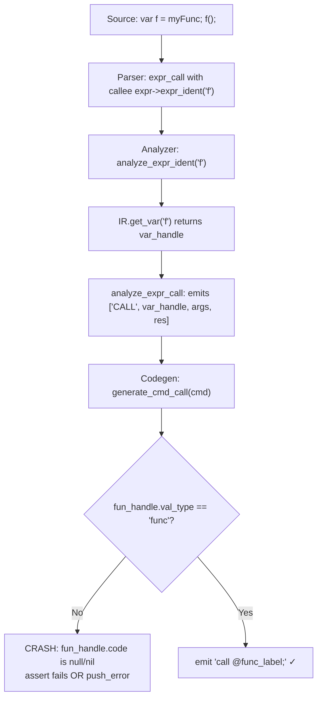

# Implementation Plan: Character Literals (`'a'`, `'\n'`)

## Overview

Add single-quoted character literals to MiniDerp. A char literal like `'a'` resolves to the integer ASCII value of the character (97 for `'a'`). Escape sequences like `'\n'` are resolved to their single-byte values (10 for `'\n'`).

**Key design decision**: Char literals are **integers** (ASCII byte values), not strings. This means they flow through the compiler pipeline as numeric immediates — no new IR types, no new codegen paths, and minimal analyzer changes.

---

## Pipeline Flow

```
Source: x = 'a';
  ↓ Tokenizer
[IDENT:x] [OP:=] [CHAR:a] [PUNCT:;]
  ↓ Parser (grammar rule: CHAR → expr_immediate)
AST: (assignment_stmt (expr (expr_immediate (CHAR 'a'))) ...)
  ↓ Analyzer (resolve ASCII 97, emit int immediate)
IR: MOV x_var, imm_97
  ↓ Codegen (existing int immediate path)
Assembly: mov eax, $imm_97; mov ^x_var, eax;
  ↓ Assembler (existing data allocation)
Machine code
```

---

## Changes Required

### File 1: [`scenes/word_boundary_tokenizer.gd`](scenes/word_boundary_tokenizer.gd) — New CHAR token class

**Why**: The tokenizer's `tok_ch_class()` currently returns `"ERROR"` for single quotes since `'` isn't classified as SPACE, WORD, NUMBER, PUNCT, or STRING. We need to teach it about CHAR literals analogously to how STRING literals work.

**Changes**:

1. **`tok_ch_class()`** (line 63-69): Add a check for `'`:
   ```gdscript
   if ch == "'": return "CHAR";
   ```
   Place this after the STRING check or before the ERROR fallback.

2. **`should_split_on_transition()`** (line 34-40): Add CHAR handling mirroring STRING:
   - `old_tok_class == "CHAR" and new_tok_class == "CHAR"` → `return true` (split on begin/end quotes)
   - `old_tok_class == "CHAR"` → `return false` (keep accumulating content between quotes)

   **Rationale**: STRING uses `"` as both start and end delimiter. CHAR uses `'` the same way. When the tokenizer is inside a CHAR token (between the quotes) and encounters any character (WORD, PUNCT, NUMBER, etc.), it should stay in CHAR mode. When it sees another `'`, it should split — emitting the CHAR content and starting a new ENDCHAR token.

3. **End-of-char handling**: When a CHAR→CHAR transition triggers a split, the closing quote needs special treatment. Follow the STRING pattern:
   ```
   if tok_class == "CHAR" and new_tok_class == "CHAR":
       new_tok_class = "ENDCHAR"
       cur_tok = cur_tok.substr(1)  # remove leading quote
   ```

   This produces:
   - A `CHAR` token with `text = "a"` (content between quotes, leading quote stripped)
   - An `ENDCHAR` token (to be filtered out)

### File 2: [`scenes/md_tokenizer.gd`](scenes/md_tokenizer.gd) — CHAR token post-processing

**Why**: CHAR tokens contain raw text (e.g., `\n` as two characters backslash+n). We need to resolve escape sequences and produce the final ASCII byte value. This file orchestrates all tokenization and is where CHAR→NUMBER conversion happens.

**Changes**:

1. **`filter_tokens()`** (line 179-181): Add `"ENDCHAR"` to the filter list:
   ```gdscript
   var filtered = ["SPACE", "ENDSTRING", "ENDCHAR"];
   ```

2. **`token_colors`** (line 16-24): Add CHAR color (reuse NUMBER color since chars resolve to integers):
   ```gdscript
   "CHAR":Color(1.0, 1.0, 0.0, 1.0),
   ```

3. **New function `resolve_char_tokens(tokens)`**: Post-process step that converts CHAR tokens. Specifically:
   - Scan all tokens for `tok_class == "CHAR"`
   - Validate: CHAR token text must be exactly 1 character after escape resolution
   - Resolve escape sequences to their ASCII byte value
   - Convert the CHAR token into a NUMBER token with the ASCII value as text
   - Invalid chars (empty, multi-char without escape) should trigger an error

4. **Call `resolve_char_tokens` in `tokenize()`** (lines 50-66): Add after `reclassify_tokens` and before `filter_tokens`:
   ```
   tokenize → basic_tokenize → recombine_tokens → reclassify_tokens → resolve_char_tokens → filter_tokens
   ```

   **Escape sequence resolution table**:

   | Sequence | ASCII Value | Meaning     |
   |----------|-------------|-------------|
   | `\n`     | 10          | Newline     |
   | `\t`     | 9           | Tab         |
   | `\r`     | 13          | Carriage Return |
   | `\0`     | 0           | Null        |
   | `\\`     | 92          | Backslash   |
   | `\'`     | 39          | Single Quote |
   | `\"`     | 34          | Double Quote |
   | Any other `\x` | —    | Error — unknown escape |

### File 3: [`scenes/parser_md.gd`](scenes/parser_md.gd) — No change needed

The parser already accepts any `tok_class` in the token stream and passes it through to the AST as-is. The `CHAR` token will just go into the AST as a leaf node under `expr_immediate`, just like `NUMBER` and `STRING`.

### File 4: [`scenes/lang_md.gd`](scenes/lang_md.gd) — No change needed

The grammar already has `["NUMBER", "*", "expr_immediate"]` and `["STRING", "*", "expr_immediate"]`. Since CHAR tokens are converted to NUMBER tokens before parsing, no grammar rule change is needed.

### File 5: [`scenes/analyzer_md.gd`](scenes/analyzer_md.gd) — No change needed

`analyze_expr_immediate()` already handles `NUMBER` tokens by reading them as integers/floats. Since CHAR tokens become NUMBER tokens with ASCII values as text, the existing path handles them.

## Testing

Create a test file [`res/data/chartest.md`](res/data/chartest.md):

```miniderp
char_test:
    print 'a';      # prints 97 (ASCII 'a')
    print '\\n';    # prints 10 (newline)
    print '\\t';    # prints 9 (tab)
    print '\\'';    # prints 39 (single quote)
    print '0';      # prints 48 (ASCII '0')
    x = 'b';
    print x;        # prints 98 (ASCII 'b')
    return;
```

Add test program test cases:
- Single printable char: `print 'A';` → prints 65
- Escape sequences: `print '\n';` → prints 10
- Variable assignment: `x = 'x'; print x;` → prints 120
- Arithmetic: `print 'A' + 1;` → prints 66 (char + int)
- Comparison: `if 'a' == 97: print 1;` → prints 1

## Limitations

- Multi-byte characters (Unicode) are not supported — `'é'` would be two bytes, which should trigger an error
- Empty char literals (`''`) should be an error
- The tokenizer converts CHAR to NUMBER before the parser sees it, meaning syntax highlighting of char tokens in the IDE would show them as NUMBER-colored rather than a distinct char color

---

---

# Bug Fix: Calling a Variable as a Function (`f()` syntax)

## Overview

**Bug**: When an identifier that resolves to a **variable** (not a function) is called with `()` syntax, the compiler fails. The grammar already accepts `f()` for any expression `f`, but the `analyze_expr_call()` in the semantic analyzer emits a `["CALL", fun, args, res]` IR command where `fun` is a variable handle. The codegen's `generate_cmd_call()` then crashes because it expects `fun` to be a function handle with a `.code` field pointing to a code block.



**Root Cause**: The `analyze_expr_ident()` function (line 417 of [`scenes/analyzer_md.gd`](scenes/analyzer_md.gd)) looks up an identifier in the **vars** list first, then falls back to the **funcs** list. When a variable exists with that name, the var handle is pushed onto the expression stack. The `analyze_expr_call()` function (line 226) then blindly uses this handle as a function callee, creating a `CALL` IR command that the codegen cannot process correctly.

**Secondary Issue**: Even if the CALL codegen were fixed to handle variable handles, the ZVM's `call` instruction takes a **label** (direct call), not a register or dereferenced pointer. So true indirect calls require changes at multiple levels.

## Recommended Approach: Full Indirect Calls (Approach B) — Phased Implementation

I recommend a **three-phase approach** that incrementally builds toward full function pointer support:

### Phase 1: Function Name → Address Resolution
**Goal**: Make function names resolve to their entry address when used as expression values (e.g., `var f = myFunc;`).

### Phase 2: Indirect Call through Variables
**Goal**: Support calling through a variable that holds a function address (e.g., `f()` where `f` is a variable).

### Phase 3: Assignment/Copy of Function Pointers
**Goal**: Support reassignment of function pointer variables and passing them as arguments.

**Why not Approach A (desugaring)?** Desugaring only works for trivial `var f = knownFunc; f()` patterns. It cannot handle any runtime indirection. Given that the ZVM already supports register-based `call` via `fetch_dest()`, the incremental path to full support is straightforward.

**Why not Approach C (stub)?** Stubs don't produce correct executable code, which is worse than an error message.

---

## Pipeline Flow (After Full Implementation)

```
Source: var f = myFunc;
  ↓ Analyzer Phase 1
IR: MOV f_var, func_addr_imm   # stores function entry address as an immediate

Source: f();
  ↓ Analyzer Phase 2
IR: CALL_INDIRECT f_var, args, res   # calls through variable
  ↓ Codegen Phase 2
Assembly: mov eax, $f_var;  call eax;  add esp, N;  mov ^res, eax;
  ↓ Assembler (existing)
Machine code with register-based CALL
  ↓ VM execution
_call(eax_value) → pushes return address, jumps to the stored address
```

---

## Phase 1: Function Name → Address Resolution

### What Changed

Function names are currently opaque handles in the IR. When `analyze_expr_ident()` resolves an identifier to a function, it pushes the function handle (val_type="func") onto the expression stack. This handle has no `load_value` representation in codegen — it has no `storage` field, so `load_value()` hits a `push_error`.

**Fix**: When an identifier resolves to a function in `analyze_expr_ident()`, emit the function's entry label as an **immediate address value**. This makes the function name a first-class expression value.

### File 1: [`scenes/analyzer_md.gd`](scenes/analyzer_md.gd) — Modify `analyze_expr_ident()`

**Location**: Line 417-431

**Current behavior**:
```gdscript
var var_handle = IR.get_var(var_name);
if not var_handle:
    var_handle = IR.get_func(var_name);
if not var_handle: 
    erep.error(E.ERR_29 % var_name);
    var_handle = IR.new_val_error();
expr_stack.push_back(var_handle);
```

**Change**: When the identifier resolves to a function (via `get_func`), create an **immediate value** holding the function's code block label instead of pushing the raw function handle:

```gdscript
var var_handle = IR.get_var(var_name);
if not var_handle:
    var_handle = IR.get_func(var_name);
    if var_handle:
        # Create an immediate value holding the function's entry label
        var func_imm = IR.new_val_immediate(var_handle.ir_name, "func_ptr");
        func_imm["code_label"] = var_handle.code;  # store code block reference for codegen
        expr_stack.push_back(func_imm);
        return;
if not var_handle: 
    erep.error(E.ERR_29 % var_name);
    var_handle = IR.new_val_error();
expr_stack.push_back(var_handle);
```

**Key insight**: The immediate value's `value` field contains the function's IR name (which resolves to a code label in codegen). The new `code_label` field points to the actual code block so the codegen can mark it as referenced.

### File 2: [`scenes/codegen_md.gd`](scenes/codegen_md.gd) — Modify `load_value()` for func_ptr type

**Location**: Line 514-538

**Change**: Handle `data_type == "func_ptr"` in `load_value()`:
```gdscript
if handle.data_type == "func_ptr":
    res = handle.ir_name;  # returns the func label name directly
```

This makes `$func_ir_name` resolve to the function's code label, which can be used in MOV instructions to store the address into a variable.

---

## Phase 2: Indirect Call through Variables

### File 3: [`scenes/analyzer_md.gd`](scenes/analyzer_md.gd) — Modify `analyze_expr_call()`

**Location**: Line 226-250

**Change**: After popping the callee from `expr_stack`, check if it's a variable handle (or other non-func handle). If so, emit `CALL_INDIRECT` instead of `CALL`:

```gdscript
func analyze_expr_call(ast):
    if error_code != "": return;
    assert(ast.tok_class == "expr_call");
    var expr1 = ast.children[0];
    assert(expr1.tok_class == "expr");
    analyze_expr(expr1);
    var fun = expr_stack.pop_back();
    var args = [];
    # ... (argument parsing unchanged) ...
    
    var res = IR.new_val_temp();
    IR.save_variable(res);
    
    if fun.val_type == "func" or (fun.has("data_type") and fun.data_type == "func_ptr"):
        # Direct call to a known function
        IR.emit_IR(["CALL", fun, args, res], ast.get_location());
    elif fun.val_type == "variable":
        # Indirect call through a variable (function pointer)
        IR.emit_IR(["CALL_INDIRECT", fun, args, res], ast.get_location());
    else:
        # Error: can't call this expression
        erep.error("cannot call expression of type '%s'" % fun.val_type);
        IR.emit_IR(["CALL_INDIRECT", IR.new_val_error(), args, res], ast.get_location());
    
    expr_stack.push_back(res);
```

### File 4: [`scenes/codegen_md.gd`](scenes/codegen_md.gd) — New `generate_cmd_call_indirect()`

**Location**: After `generate_cmd_call()` (around line 408)

**New function**:
```gdscript
func generate_cmd_call_indirect(cmd:IR_Cmd)->void:
    # CALL_INDIRECT var arg(s) res
    var var_name = cmd.words[1];
    assert(var_name in all_syms);
    var args = [];
    if cmd.words[2] == "[":
        var i = 3;
        while true:
            if cmd.words[i] == "]": break;
            args.append(cmd.words[i]);
            i += 1;
    else:
        args.append(cmd.words[3]);
    var res = cmd.words[-1];
    args.reverse();
    var n_args = len(args);
    var pushed_stack_size = 4 * n_args;
    
    # Push arguments (same as direct call)
    for arg in args:
        emit("push $%s;\n" % arg, cmd_size, "generate_cmd_call_indirect.args");
    
    # Load the function address from the variable into EAX
    emit("mov eax, $%s;\n" % var_name, cmd_size, "generate_cmd_call_indirect.load_addr");
    
    # Call through the register (ZVM's call reg uses the register value as target IP)
    emit("call eax;\n", cmd_size, "generate_cmd_call_indirect.call");
    
    # Clean up stack and store result (same as direct call)
    emit("add ESP, %s;\n" % pushed_stack_size, cmd_size, "generate_cmd_call_indirect.stack");
    emit("mov ^%s, eax;\n" % res, cmd_size, "generate_cmd_call_indirect.result");
```

### File 5: [`scenes/codegen_md.gd`](scenes/codegen_md.gd) — Register `CALL_INDIRECT` handler

**Location**: Line 262-275, in `generate_cmd()` match statement

**Change**: Add one new case:
```gdscript
match cmd.words[0]:
    # ... existing cases ...
    "CALL": generate_cmd_call(cmd);
    "CALL_INDIRECT": generate_cmd_call_indirect(cmd);
    # ... rest ...
```

### File 6: [`scenes/CPU_vm.gd`](scenes/CPU_vm.gd) — Verify `cmd_call` supports register target

**Location**: Line 401-403

**Current behavior**:
```gdscript
func cmd_call(cmd): 
    var dest = fetch_dest(cmd);
    if(check_jmp_cond(cmd)): _call(dest);
```

**Verification**: `fetch_dest()` (line 284) computes the destination value from register + offset + dereference. When we do `call eax;`, the assembler encodes this as a CALL instruction with reg1 = EAX. `fetch_dest` returns the value of EAX, and `_call` jumps to that address. **This already works — no change needed.** ✓

### File 7: [`scenes/comp_asm_zd.gd`](scenes/comp_asm_zd.gd) — Verify `call eax;` syntax is valid

**Verification**: `parse_command()` (line 450) calls `parse_arg()` which handles registers (line 595-596). The CALL instruction takes a standard destination argument, so `call eax;` encodes as CALL with reg1 = EAX. **This already works — no change needed.** ✓

---

## Phase 3: Assignment/Copy of Function Pointers

### File 8: [`scenes/analyzer_md.gd`](scenes/analyzer_md.gd) — Handle func_ptr in `analyze_decl_assignment()`

**Location**: Line 312-338

**Change**: When assigning a func_ptr-typed value to a variable, propagate the type:
```gdscript
var_handle.data_type = arg.data_type;  # already exists
if arg.has("code_label") and arg.data_type == "func_ptr":
    var_handle["resolved_func"] = arg.code_label;
```

This records that the variable holds a function pointer to a known function, which can be used for optimization (direct call instead of indirect) and arity checking.

---

## Files Modified Summary

| # | File | Changes | Complexity |
|---|------|---------|------------|
| 1 | [`scenes/analyzer_md.gd`](scenes/analyzer_md.gd) | `analyze_expr_ident()` — emit immediate for func names; `analyze_expr_call()` — detect variable callee, emit `CALL_INDIRECT`; `analyze_decl_assignment()` — propagate func_ptr type | Medium |
| 2 | [`scenes/codegen_md.gd`](scenes/codegen_md.gd) | New `generate_cmd_call_indirect()` function; register in `generate_cmd()` dispatch; handle func_ptr in `load_value()` | Medium |
| 3 | [`scenes/CPU_vm.gd`](scenes/CPU_vm.gd) | No change needed — ZVM's `call reg` already works | None |
| 4 | [`scenes/comp_asm_zd.gd`](scenes/comp_asm_zd.gd) | No change needed — assembler handles `call eax;` syntax | None |
| 5 | [`scenes/ir_md.gd`](scenes/ir_md.gd) | No change needed — IR commands are string arrays, new `CALL_INDIRECT` is just a new command name | None |
| 6 | [`scenes/lang_md.gd`](scenes/lang_md.gd) | No change needed — grammar already accepts `expr ( ... )` for any expression | None |

---

## Limitations and Edge Cases

### Supported
- `var f = myFunc; f();` — variable holds a known function, call works
- `var f; f = myFunc; f();` — function pointer stored then called (Phase 3)
- `var f = someFunc; g = f; g();` — copy function pointer (Phase 3)

### Not Supported (Phase 3+)
- **Passing function pointers as arguments**: `callWithCallback(myFunc)` requires parameter type handling
- **Dynamic dispatch**: `if cond: f = a; else: f = b; f();` — the variable's value is unknown at compile time, which is handled by Phase 2 (indirect call) but requires Phase 3 for assignment tracking
- **Returning function pointers from functions**: Requires return type system
- **Function pointer arrays**: `arr[0]()` requires array-of-function-pointers support

### Error Cases
- Calling a variable that doesn't hold a function address: runtime crash (no type system protection)
- Calling a non-variable, non-function expression (e.g., `42()`): caught by analyzer with descriptive error

---

## Test Cases

Create a test file [`res/data/funcptr_test.md`](res/data/funcptr_test.md):

```miniderp
# Test 1: Basic function alias
myFunc:
    print 42;
    return;

main:
    var f = myFunc;
    f();          # should print 42
    return;
```

```miniderp
# Test 2: Function pointer with arguments
add:
    a, b = pop, pop;
    push a + b;
    return;

main:
    var adder = add;
    adder(3, 4);  # should print 7
    print;
    return;
```

```miniderp
# Test 3: Error case — calling non-function variable
main:
    var x = 5;
    x();          # should produce compile error
    return;
```

### Expected Results

| Test Case | Expected Behavior |
|-----------|-------------------|
| `var f = myFunc; f();` | Output: 42 |
| `adder(3, 4); print;` | Output: 7 |
| `var x = 5; x();` | Compile error: "cannot call expression" |
| Direct call unchanged | `myFunc();` continues to work as before |

---

## Implementation Order

1. **Phase 1**: [`scenes/analyzer_md.gd`](scenes/analyzer_md.gd) — `analyze_expr_ident()` func_name → immediate
   - Test: `var f = myFunc;` should compile without error (even if `f` is unused)

2. **Phase 1 codegen**: [`scenes/codegen_md.gd`](scenes/codegen_md.gd) — `load_value()` for func_ptr type
   - Test: Assign function name to variable, verify IR has MOV with func label

3. **Phase 2 analyzer**: [`scenes/analyzer_md.gd`](scenes/analyzer_md.gd) — `analyze_expr_call()` detect variable callee, emit `CALL_INDIRECT`
   - Test: `var f = myFunc; f();` should compile and run

4. **Phase 2 codegen**: [`scenes/codegen_md.gd`](scenes/codegen_md.gd) — `generate_cmd_call_indirect()` + dispatch registration
   - Test: Full pipeline compilation of funcptr_test.md

5. **Regression**: Compile all existing test programs in [`res/data/`](res/data/) to ensure no regressions

6. **Document**: Update [`docs/todo.md`](docs/todo.md) to mark as completed
