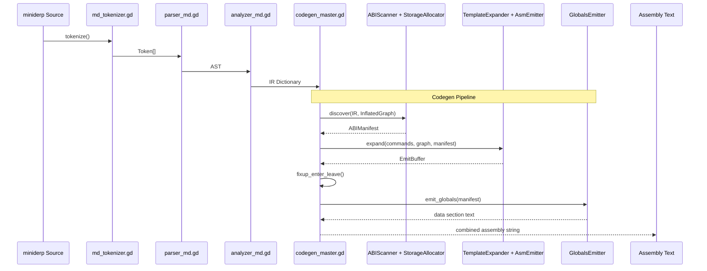
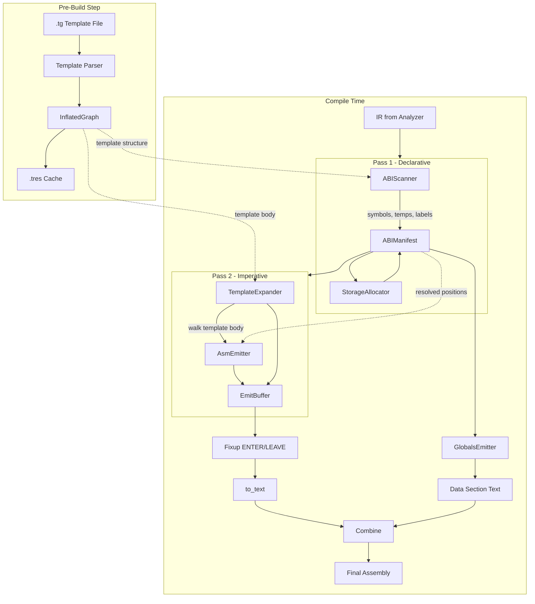
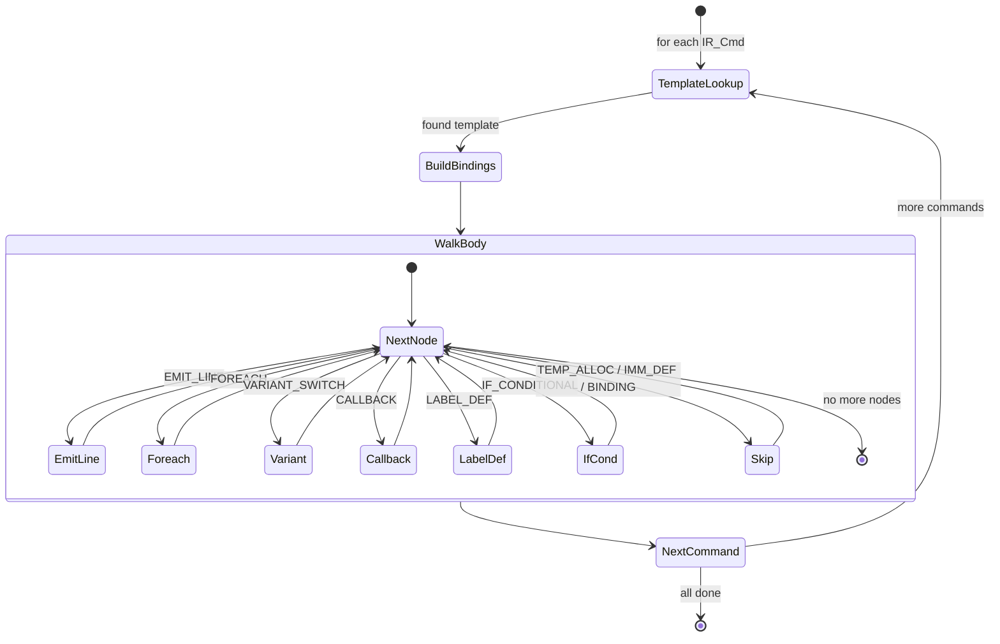

# Codegen Architecture — Diagram Specification

**Date**: 2026-06-28  
**Purpose**: Provide enough detail for a diagram agent to create architectural diagrams without reading source code.  
**Pipeline**: Two-pass template-driven codegen that replaces 13 hand-written `generate_cmd_*` functions.

---

## Table of Contents

1. [Systems Inventory](#1-systems-inventory)
2. [Data Flow Diagram Spec](#2-data-flow-diagram-spec)
3. [Horizontal Slice: Pipeline Stages](#3-horizontal-slice-pipeline-stages)
4. [Vertical Slice: The MOV Template](#4-vertical-slice-the-mov-template)
5. [Cross-Cutting Concerns](#5-cross-cutting-concerns)
6. [Template Engine Architecture](#6-template-engine-architecture)
7. [Data Model Relationships](#7-data-model-relationships)

---

## 1. Systems Inventory

Every GDScript class and resource file in the new codegen pipeline, listed with a one-line purpose.

### Orchestration Layer

| File / Class | Purpose |
|---|---|
| [`scenes/comp_compile_md.gd`](scenes/comp_compile_md.gd) | Integration point — the compiler entry that chains Tokenizer → Parser → Analyzer → Codegen. Contains the `use_new_codegen` toggle. |
| [`scenes/comp_codegen_new.gd`](scenes/comp_codegen_new.gd) | Scene-tree wrapper that hosts `CodegenMaster` as a child node and provides drop-in `parse_file()` / `fixup_symtable()` API. |
| [`scenes/codegen_master.gd`](scenes/codegen_master.gd) | Pipeline orchestrator — wires Pass 1 ABI Scanner + Pass 2 Template Expander, manages migrated/unmigrated command dispatch, appends globals section. |
| [`scenes/codegen_md.gd`](scenes/codegen_md.gd) | OLD codegen — kept as fallback for unmigrated commands. Referenced by CodegenMaster for deserialization and fallback emit. |

### Pass 1 — Declarative Discovery

| File / Class | Purpose |
|---|---|
| [`scenes/abi_scanner.gd`](scenes/abi_scanner.gd) (`ABIScanner`) | Pass 1 entry point. Walks IR scopes for symbol declarations, walks each IR command's matched template body to discover temps/labels/imms/callbacks, then calls StorageAllocator. |
| [`scenes/stor_alloc.gd`](scenes/stor_alloc.gd) (`StorageAllocator`) | Allocates concrete storage positions for all symbols (stack offsets), temporaries (round-robin registers EAX/EBX/ECX/EDX with stack spill), and immediates. Mirrors old codegen positions for golden-file compatibility. |
| [`scenes/ab_manifest.gd`](scenes/ab_manifest.gd) (`ABIManifest`) | Pass 1 output data structure. Holds `symbols` Dictionary (ir_name → SymbolInfo), `labels` Dictionary (meta_name → generated_name), `temps` Array[TempSlot], `scope_stack_sizes`, `reachable_cbs`. |

### Pass 2 — Imperative Expansion

| File / Class | Purpose |
|---|---|
| [`scenes/tmpl_expand.gd`](scenes/tmpl_expand.gd) (`TemplateExpander`) | Pass 2 entry point. Iterates flat command list, looks up each command's template in the InflatedGraph, walks the template body nodes, delegates EMIT_LINE to AsmEmitter, handles FOREACH/VARIANT/CALLBACK/LABEL/IF nodes. |
| [`scenes/asm_emit.gd`](scenes/asm_emit.gd) (`AsmEmitter`) | Resolves `{slot_name}` references in emitted text patterns using RegResolver, appends resolved lines to EmitBuffer with location tracking. Also performs ENTER/LEAVE fixup. |
| [`scenes/reg_resolve.gd`](scenes/reg_resolve.gd) (`RegResolver`) | Stateless resolver that maps value/temp names to concrete assembly text (register names, stack offsets `EBP[N]`, global dereferences `*name`, immediate literals) based on the pre-allocated ABIManifest. |
| [`scenes/globals_emit.gd`](scenes/globals_emit.gd) (`GlobalsEmitter`) | Walks ABIManifest symbols and emits DB/ALLOC directives for all global-storage symbols (variables, arrays, string immediates). Mirrors old `generate_globals()`. |
| [`scenes/codegen_result.gd`](scenes/codegen_result.gd) (`CodegenResult`, `EmitBuffer`) | Pipeline result type (success/failure discriminated union). Also contains the EmitBuffer inner class — a typed collector of AssemblyPart records that supports delayed stringification, location-map building, and post-processing fixup. |

### Template Engine

| File / Class | Purpose |
|---|---|
| [`scenes/template_parser.gd`](scenes/template_parser.gd) (`TemplateParser`) | Parses `.tg` template files into InflatedGraph. Handles @template, @bind, @temp, @label, @new_imm, @variant, @emit_cb, for/endfor, if/endif. Implements timestamp-based `.tres` caching. |
| [`scenes/inflated_template_graph.gd`](scenes/inflated_template_graph.gd) (`InflatedGraph`) | Data model — extends Resource for .tres serialization. Contains `TemplateDef`, `SlotDef`, `ITGNode` + 8 subclasses (EmitLineNode, ForEachNode, VariantSwitchNode, CallbackNode, TempAllocNode, LabelDefNode, ImmDefNode, BindingNode), plus `SlotRef` with role enum. |
| [`res/templates/codegen_templates.tg`](res/templates/codegen_templates.tg) | Template source file — human-readable assembly-like format defining the mapping from all 13 IR commands to ZVM assembly. Pre-processed at build time. |

### Supporting Data Classes

| File / Class | Purpose |
|---|---|
| [`scenes/ir_md.gd`](scenes/ir_md.gd) | IR definition — the intermediate representation produced by the analyzer and consumed by codegen. |
| [`class_IR_cmd.gd`](class_IR_cmd.gd) | IR_Cmd — one command in the IR with `words` Array and `loc` LocationRange. |
| [`class_Location.gd`](class_Location.gd) | Source location tracking (line/column). |
| [`class_LocationRange.gd`](class_LocationRange.gd) | Range of source locations. |
| [`class_LocationMap.gd`](class_LocationMap.gd) | Maps assembly byte positions back to source locations for the debugger. |

---

## 2. Data Flow Diagram Spec

### 2.1 Data Format Inventory

| Format | Description | Producer | Consumer |
|---|---|---|---|
| **miniderp source** | Textual input language (.md files) | User / editor | Tokenizer |
| **Token stream** | `Array[Token]` from tokenizer | `md_tokenizer.gd` | `parser_md.gd` |
| **AST** | Abstract Syntax Tree from parser | `parser_md.gd` | `analyzer_md.gd` |
| **IR** | Dictionary-based intermediate representation — contains `scopes`, `code_blocks`, `strings` | `analyzer_md.gd` | `codegen_master.gd` |
| **IR_Cmd** | One command in the IR with `words: Array[String]` and `loc: LocationRange` | Deserialized by old codegen | Pass 1 + Pass 2 |
| **.tg templates** | Textual template file — assembly-like with @directives | Hand-written in `res/templates/` | `template_parser.gd` |
| **InflatedGraph** | Compiled template graph — `Dictionary[template_name → TemplateDef]` | `template_parser.gd` | Cached as .tres / loaded by codegen_master |
| **ABIManifest** | Pass 1 output — all symbols allocated, labels generated, temps assigned | `abi_scanner.gd` + `stor_alloc.gd` | Pass 2 (tmpl_expand, asm_emit, globals_emit) |
| **EmitBuffer** | Typed list of AssemblyPart records (TEXT / LABEL / LOCATION_MARKER) | `tmpl_expand.gd` + `asm_emit.gd` | `fixup_enter_leave()` → `to_text()` |
| **Assembly text** | Final zderp assembly string | `codegen_result.gd` → `to_text()` | `comp_asm_zd.gd` (assembler) |
| **LocationMap** | Maps byte positions in assembly back to source lines | `EmitBuffer.build_location_map()` | Debugger / highlight in editor |

### 2.2 Data Flow Diagram (text)

```
                        PRE-BUILD TIME (once per template edit)
                        ======================================
                        
  codegen_templates.tg  ──────┐
  res/templates/               │
                               ▼
                     ┌─────────────────┐
                     │ template_parser │
                     │ .gd             │
                     └────────┬────────┘
                              │ parse()
                              ▼
                     ┌─────────────────┐
                     │  InflatedGraph  │
                     │  (Resource)     │
                     └────────┬────────┘
                              │ ResourceSaver.save()
                              ▼
                     ┌─────────────────┐
                     │  .tres cache    │
                     │  (on disk)      │
                     └─────────────────┘
                              │
                    (loaded on next launch
                     if .tg is unchanged)


                        COMPILE TIME (per compilation)
                        ==============================

  miniderp source ──────┐
  .md files              │
                         ▼
                 ┌──────────────┐
                 │  Tokenizer   │──→ Token[]
                 │  md_tokenizer│
                 └──────────────┘
                         │
                         ▼
                 ┌──────────────┐
                 │   Parser     │──→ AST
                 │  parser_md   │
                 └──────────────┘
                         │
                         ▼
                 ┌──────────────┐
                 │  Analyzer    │──→ IR Dictionary
                 │ analyzer_md  │    { scopes, code_blocks, strings }
                 └──────────────┘
                         │
                         ▼
                 ┌──────────────────────────────────────┐
                 │         codegen_master.gd             │
                 │                                      │
                 │  ┌─► Pass 1: ABIScanner.discover()   │
                 │  │   IR + InflatedGraph               │
                 │  │              │                      │
                 │  │              ▼                      │
                 │  │   StorageAllocator.allocate()      │
                 │  │              │                      │
                 │  │   ABIManifest ◄──────────────────────┘
                 │  │                                      │
                 │  └─► Flatten commands ──────────────────┤
                 │                                         │
                 │  ┌─► Separate migrated vs unmigrated    │
                 │  │                                      │
                 │  ├── migrated ──► Pass 2: tmpl_expand   │
                 │  │   + InflatedGraph + ABIManifest      │
                 │  │              │                       │
                 │  │              ▼                       │
                 │  │   AsmEmitter (resolve+emit)           │
                 │  │              │                       │
                 │  │   EmitBuffer ─── fixup_enter_leave   │
                 │  │              │                       │
                 │  │              ▼                       │
                 │  │   Assembly text (migrated)           │
                 │  │                                      │
                 │  ├── unmigrated ──► old codegen fallback │
                 │  │                                      │
                 │  └── combine │                           │
                 │              │                           │
                 │   + GlobalsEmitter.emit_globals()       │
                 │              │                           │
                 └──────────────┼───────────────────────────┘
                                ▼
                     ┌─────────────────────┐
                     │  Final Assembly     │
                     │  String (.zd file)  │
                     └─────────────────────┘
                                │
                                ▼
                     ┌─────────────────────┐
                     │  comp_asm_zd.gd     │
                     │  (assembler)        │
                     └─────────────────────┘
```

### 2.3 Key Data Transformations

| Step | Input → Output | Transformation Description |
|---|---|---|
| Tokenizer | Source text → `Array[Token]` | Lexical analysis: chars → tokens |
| Parser | Tokens → AST | Grammar-driven parse: tokens → syntax tree |
| Analyzer | AST → IR Dictionary | Semantic analysis: AST → scoped IR with code blocks |
| **Pass 1** | IR + InflatedGraph → ABIManifest | Symbol discovery + template scanning + storage allocation |
| **Pass 2** | IR + InflatedGraph + ABIManifest → EmitBuffer | Template body walking + slot resolution + assembly emit |
| Fixup | EmitBuffer → EmitBuffer (modified) | Replace `__ENTER_{scp}`/`__LEAVE_{scp}` markers with concrete stack adjustments |
| Globals | ABIManifest → Assembly text | Emit DB/ALLOC directives for global-storage symbols |
| Stringify | EmitBuffer → String | Concatenate all AssemblyPart.text values |

---

## 3. Horizontal Slice: Pipeline Stages

### Stage 0: Frontend (Tokenizer → Parser → Analyzer)

**Purpose**: Convert source text to IR for codegen consumption.

| Aspect | Details |
|---|---|
| **Entry** | [`comp_compile_md.gd:compile()`](scenes/comp_compile_md.gd:36) |
| **Input** | miniderp source text (.md file) |
| **Process** | `tokenizer.tokenize()` → `parser.parse()` → `analyzer.analyze()` |
| **Output** | IR Dictionary with `scopes`, `code_blocks`, `strings` |
| **Output Format** | Dictionary; each code block has `name`, `ir_name`, `lbl_from`, `lbl_to`, `code: Array[IR_Cmd]`; each IR_Cmd has `words: Array[String]` and `loc: LocationRange` |

### Stage 1: Pass 1 — ABI Discovery

**Purpose**: Discover all symbols, temporaries, labels, and immediates before any emit begins.

| Aspect | Details |
|---|---|
| **Entry** | [`codegen_master.gd:generate()`](scenes/codegen_master.gd:129) → [`ABIScanner.discover(IR, graph)`](scenes/abi_scanner.gd:57) |
| **Input** | IR Dictionary (from analyzer), InflatedGraph (loaded from cache) |
| **Process** | 1. Walk `IR.scopes` → register all variable/function symbols into manifest<br>2. Walk `IR.code_blocks`, match each IR_Cmd to its template in InflatedGraph<br>3. For each matched template, recursively walk the template body nodes and collect:<br>   - `@temp` declarations → add TempSlot to manifest<br>   - `@label` declarations → generate unique label names (`lbl_N__name`)<br>   - `@new_imm` → add immediate SymbolInfo to manifest<br>   - `@ref_cb` → record reachable code block in manifest<br>   - `@needs_deref` → set flag on symbol<br>   - Scan ALL variant branches conservatively (emit-time variant unknown in Pass 1) |
| **Output** | ABIManifest (symbols, labels, temps, scope_stack_sizes, reachable_cbs) — **not yet allocated** |
| **Files** | [`scenes/abi_scanner.gd`](scenes/abi_scanner.gd), [`scenes/stor_alloc.gd`](scenes/stor_alloc.gd) |

### Stage 1b: Storage Allocation

**Purpose**: Assign concrete storage positions for all discovered symbols.

| Aspect | Details |
|---|---|
| **Entry** | `ABIScanner.discover()` calls `StorageAllocator.allocate()` |
| **Input** | ABIManifest (unallocated symbols), IR Dictionary (for scope structure) |
| **Process** | 1. `allocate()` — walk IR scopes, for each variable/function handle set `storage_type` and `storage_pos` on the SymbolInfo:<br>   - Global scope → `storage_type = "global"`, `storage_pos = 0`<br>   - Local vars → `storage_type = "stack"`, position = `-3 + N` (grows DOWN from EBP)<br>   - Args → `storage_type = "stack"`, position = `9 + N` (grows UP from EBP)<br>   - Functions → `storage_type = "code"` or `"extern"`<br>2. `allocate_temps()` — round-robin through EAX, EBX, ECX, EDX; spill to stack when exhausted<br>3. `allocate_imms()` — ensure immediate symbols have `storage_type = "immediate"` |
| **Output** | ABIManifest (fully allocated — all positions resolved) |
| **Precision Requirement** | Must produce byte-identical positions to old codegen for golden-file compatibility |
| **Files** | [`scenes/stor_alloc.gd`](scenes/stor_alloc.gd) |

### Stage 2: Pass 2 — Template Expansion

**Purpose**: Walk the template graph for each migrated IR command and produce typed assembly parts.

| Aspect | Details |
|---|---|
| **Entry** | [`codegen_master.gd:_expand_migrated()`](scenes/codegen_master.gd:318) → [`TemplateExpander.expand()`](scenes/tmpl_expand.gd:38) |
| **Input** | Flat Array[IR_Cmd] (migrated commands only), InflatedGraph, ABIManifest |
| **Process** | 1. For each IR_Cmd, look up its template by `cmd.words[0]` in InflatedGraph<br>2. Build bindings Dictionary from template body's @bind nodes<br>3. Walk template body nodes (EMIT_LINE, FOREACH, VARIANT_SWITCH, CALLBACK, LABEL_DEF, IF_CONDITIONAL)<br>   - EMIT_LINE → call `AsmEmitter.emit_line()` to resolve `{slot}` refs and append to EmitBuffer<br>   - FOREACH → iterate variadic list, recurse body per element<br>   - VARIANT_SWITCH → dispatch on slot value (e.g. ADD/SUB based on `op` slot)<br>   - CALLBACK(emit_cb) → recursively expand a referenced code block<br>   - CALLBACK(reverse) → reverse a variadic list in-place<br>   - LABEL_DEF → emit pre-generated label name from manifest<br>   - IF_CONDITIONAL → conditionally emit body if slot is present/non-empty<br>   - TEMP_ALLOC / IMM_DEF / BINDING → no-op in Pass 2 (handled in Pass 1) |
| **Output** | EmitBuffer (typed AssemblyPart records with location tracking) |
| **Files** | [`scenes/tmpl_expand.gd`](scenes/tmpl_expand.gd), [`scenes/asm_emit.gd`](scenes/asm_emit.gd) |

### Stage 2b: Fixup + Globals

**Purpose**: Post-process the EmitBuffer and append the data section.

| Aspect | Details |
|---|---|
| **Entry** | `TemplateExpander.expand()` calls `AsmEmitter.fixup_enter_leave()`, then `GlobalsEmitter.emit_globals()` is called by `codegen_master.generate()` |
| **Input** | EmitBuffer (with `__ENTER_{scp}` / `__LEAVE_{scp}` placeholders), ABIManifest |
| **Process** | 1. Fixup: walk all AssemblyPart.TEXT records and replace `__ENTER_{scp}` with `sub ESP, -N` and `__LEAVE_{scp}` with `sub ESP, +N` (where N = per-scope stack size from manifest)<br>2. Globals: walk manifest.symbols, for each `storage_type == "global"` emit DB (variables, temps, string immediates) or ALLOC (arrays) directives |
| **Output** | Modified EmitBuffer (fixup) + Assembly text string (globals) |
| **Files** | [`scenes/asm_emit.gd`](scenes/asm_emit.gd), [`scenes/globals_emit.gd`](scenes/globals_emit.gd) |

### Stage 3: Assembler + Upload

**Purpose**: Assemble the final text into binary and upload to the VM.

| Aspect | Details |
|---|---|
| **Entry** | After `codegen_master.generate()` returns the assembly string |
| **Input** | Final assembly text (.zd format) |
| **Process** | 1. Save to file (`a.zd`)<br>2. `comp_asm_zd.gd` assembles text → binary<br>3. Binary uploaded to VM for execution |
| **Output** | Binary program in VM memory |
| **Files** | [`scenes/comp_asm_zd.gd`](scenes/comp_asm_zd.gd) |

---

## 4. Vertical Slice: The MOV Template

This section traces a single IR command `MOV x, y` through every pipeline stage, showing exactly what data each stage produces.

### Source Miniderp

```miniderp
mov x, y
```

### Stage 0: Tokenizer → Parser → Analyzer

The analyzer produces an IR Dictionary fragment:

```json
{
  "scopes": {
    "global": { "user_name": "global", "vars": [
      { "ir_name": "x", "val_type": "variable", "storage": "NULL", "data_type": "int", "is_array": 0 },
      { "ir_name": "y", "val_type": "variable", "storage": "NULL", "data_type": "int", "is_array": 0 }
    ], "funcs": [] }
  },
  "code_blocks": {
    "main": {
      "name": "main",
      "ir_name": "main",
      "lbl_from": "main_from",
      "lbl_to": "main_to",
      "code": [
        IR_Cmd { words: ["MOV", "x", "y"], loc: LocationRange(...) }
      ]
    }
  }
}
```

### Stage 1: Pass 1 — ABIScanner.discover()

**Input**: IR + InflatedGraph (containing MOV template)

**Template lookup**: `graph.templates["MOV"]` returns:

```
TemplateDef {
  name: "MOV",
  slots: [SlotDef("dest", STORE), SlotDef("src", LOAD)],
  body: [
    BindingNode("dest", "$cmd.words[1]"),
    BindingNode("src",  "$cmd.words[2]"),
    EmitLineNode("mov {dest}, {src};", [
      SlotRef("dest", STORE_REF),
      SlotRef("src",  LOAD_REF)
    ])
  ]
}
```

**Symbol discovery** (from `IR.scopes`):

```
manifest.symbols["x"] = SymbolInfo("x", "variable", "unallocated", 0, "int", false, 0, false, "global")
manifest.symbols["y"] = SymbolInfo("y", "variable", "unallocated", 0, "int", false, 0, false, "global")
```

**Template scanning** (for MOV command):

The MOV template has no @temp, @label, @new_imm, @ref_cb, or @needs_deref nodes, so nothing additional is discovered. The `manifest.reachable_cbs` gets `"main"` added.

**Output**: ABIManifest with:
- `symbols: { "x": SymbolInfo(...), "y": SymbolInfo(...) }`
- `labels: {}`
- `temps: []`
- `reachable_cbs: ["main"]`

### Stage 1b: StorageAllocator.allocate()

For the global scope, both `x` and `y` get `storage_type = "global"`, `storage_pos = 0` (they will be emitted in the data section).

**Output**: ABIManifest fully allocated:
```
symbols["x"] = SymbolInfo("x", "variable", "global", 0, "int", false, 0, false, "global")
symbols["y"] = SymbolInfo("y", "variable", "global", 0, "int", false, 0, false, "global")
scope_stack_sizes: { "global": 0 }
```

### Stage 2: Pass 2 — TemplateExpander.expand()

**Command flattening**: `_flatten_commands()` produces:
```
[
  IR_Cmd("__LBL_FROM__", ["main", "main_from"]),
  IR_Cmd("MOV", ["MOV", "x", "y"]),
  IR_Cmd("__LBL_TO__", ["main", "main_to"])
]
```

**Template lookup**: `graph.templates["MOV"]` found.

**Binding resolution**:
```
bindings = {
  "dest": "x",    // from $cmd.words[1]
  "src":  "y"     // from $cmd.words[2]
}
```

**Node walking**:

1. `BindingNode("dest", ...)` → pass (no-op in Pass 2)
2. `BindingNode("src", ...)` → pass (no-op in Pass 2)
3. `EmitLineNode("mov {dest}, {src};", [STORE_REF(dest), LOAD_REF(src)])`:
   - Calls `AsmEmitter.emit_line("mov {dest}, {src};", [refs], bindings, manifest, buf, loc)`
   - For `{dest}` (STORE_REF): calls `RegResolver.resolve_value("x", manifest, "store")`
     → sym = `SymbolInfo("x", "variable", "global", ...)` → `storage_type = "global"` → returns `*x`
   - For `{src}` (LOAD_REF): calls `RegResolver.resolve_value("y", manifest, "load")`
     → `storage_type = "global"` → returns `*y`
   - Resolved line: `mov *x, *y;\n`
   - Appended to EmitBuffer with source location

**EmitBuffer contents after MOV**:
```
[
  AssemblyPart(TEXT, "# Begin code block main\n", source_line=0),
  AssemblyPart(TEXT, ":main_from:\n", source_line=0),
  AssemblyPart(TEXT, "mov *x, *y;\n", source_line=N),    // N = source line number
  AssemblyPart(TEXT, ":main_to:\n", source_line=0),
  AssemblyPart(TEXT, "# End code block main\n", source_line=0)
]
```

### Stage 2b: Fixup + Globals

**Fixup**: No `__ENTER_global` or `__LEAVE_global` markers in the MOV output → no changes.

**Globals**: `GlobalsEmitter.emit_globals(manifest)` walks symbols:
- `x`: `storage_type = "global"`, `val_type = "variable"`, not array → `:x: db 0;\n`
- `y`: `storage_type = "global"`, `val_type = "variable"`, not array → `:y: db 0;\n`

### Stage 3: Final Assembly Output

```
# Begin code block main
:main_from:
mov *x, *y;
:main_to:
# End code block main

:x: db 0;
:y: db 0;
```

---

## 5. Cross-Cutting Concerns

### 5.1 Error Handling (CodegenResult)

| Aspect | Details |
|---|---|
| **Type** | Discriminated union — `is_success: bool` separates success from failure |
| **Factory methods** | `CodegenResult.success(text, loc_map)` and `CodegenResult.failure(error_message)` |
| **Success payload** | `text` (assembly String), `loc_map` (LocationMap for debugger) |
| **Failure payload** | `error_message` (String) — no assembly text |
| **Propagation** | `codegen_master.generate()` returns `CodegenResult`; `parse_file()` unwraps it and returns `""` on failure with `push_error()` |
| **Error sources** | Missing template for IR command, missing slot binding in manifest, invalid binding expression, cannot open IR file, deserialized IR is empty |

### 5.2 Location Tracking (Line Mapping for Debugger)

| Aspect | Details |
|---|---|
| **Source tracking** | Each `IR_Cmd` carries a `loc: LocationRange` from the parser/analyzer |
| **Emit side** | `AsmEmitter.emit_line()` passes the command's `loc` to `EmitBuffer.append(text, loc)` |
| **AssemblyPart** | Each part stores `source_line: int` — a reference back to the source line number |
| **Build** | `EmitBuffer.build_location_map()` walks all parts and builds a `LocationMap` mapping byte positions in the final text back to source locations |
| **Consumer** | The editor's debugger/highlight feature uses the LocationMap to highlight source lines when the VM hits a breakpoint |
| **Tightness** | Each EMIT_LINE node produces one AssemblyPart with a line mapping; labels, comments, and markers get `source_line = 0` (no mapping) |

### 5.3 Incremental Migration (Old Codegen Fallback)

| Aspect | Details |
|---|---|
| **Toggle** | `comp_compile_md.gd:use_new_codegen` (default: true) |
| **migrated_ops** | `codegen_master.gd:migrated_ops` — Dictionary of all 13 IR commands currently all migrated: MOV, OP, IF, ELSE_IF, ELSE, WHILE, CALL, CALL_INDIRECT, RETURN, ENTER, LEAVE, ALLOC, MOV_ARR |
| **Dual-path** | `codegen_master.generate()` separates the flat command list into `migrated` and `unmigrated` arrays based on `migrated_ops` |
| **Migrated path** | Pass 2 template expansion via `TemplateExpander.expand()` |
| **Unmigrated path** | Fresh old-codegen instance (`CodegenMd.new()`) with migrated commands stripped from each code block, runs old emit loop minus `generate_globals()` |
| **Combination** | Migrated text + unmigrated text + globals section are concatenated |
| **Architect fix A.6** | Fresh old-codegen instance per compilation to prevent state corruption |
| **`migrate_op()`** | Method to mark ops as migrated at runtime (used by tests) |

### 5.4 Caching (InflatedGraph .tres Cache)

| Aspect | Details |
|---|---|
| **Mechanism** | `template_parser.gd:load_or_parse()` |
| **Cache file** | `.tg` + `_cache.tres` suffix (e.g. `codegen_templates.tg` → `codegen_templates_cache.tres`) |
| **Cache validation** | Timestamp comparison — if `.tres` modification time >= `.tg` modification time, load from cache |
| **Cache format** | Godot `.tres` Resource file — uses custom `_to_dict()` / `from_dict()` serialization since inner classes are not Resources |
| **First load** | Parse `.tg` → InflatedGraph → `ResourceSaver.save()` → return graph |
| **Subsequent loads** | `ResourceLoader.load()` → return cached graph (no parsing) |
| **Re-parse trigger** | Editing the `.tg` file updates its modification time, forcing a re-parse on next compilation |
| **Path resolution** | Multiple strategies for headless vs editor mode path differences (`_resolve_tg_path()`) |

---

## 6. Template Engine Architecture

### 6.1 Overview

The template engine compiles human-readable `.tg` template files into an `InflatedGraph` data structure at pre-build time. This graph is the sole data structure consumed by both Pass 1 and Pass 2 of the codegen pipeline.

### 6.2 .tg Template Format → InflatedGraph Mapping

Each `.tg` construct maps to a specific `ITGNode` subclass:

| .tg Syntax | ITGNode Subclass | Fields | Purpose |
|---|---|---|---|
| `@template NAME(slots): ... @end` | `TemplateDef` | name, slots, body, param_variants | Container for one IR command's template |
| `(dest:store, src:load)` | `SlotDef[]` | name, type (SlotType enum), binding | Parameter slot signature |
| `@bind name = expr` | `BindingNode` | slot_name, binding_expression | Map IR word to slot |
| `@temp a, b` | `TempAllocNode` | temp_names | Declare temporaries |
| `@label a, b` | `LabelDefNode` | label_names | Declare labels |
| `@new_imm(V) → name` | `ImmDefNode` | imm_name, value | Declare immediate constant |
| `mov {dest}, {src};` | `EmitLineNode` | text_pattern, slot_refs[] | One assembly line with slot references |
| `@variant NAME:` | `VariantSwitchNode` | slot_name, variants Dict | Dispatch on slot value |
| `@emit_cb(name)` | `CallbackNode` | callback_name="emit_cb", arg_names | Recursively emit code block |
| `@ref_cb(name)` | `CallbackNode` | callback_name="ref_cb", arg_names | Mark code block reachable |
| `@needs_deref(name)` | `CallbackNode` | callback_name="needs_deref", arg_names | Set deref flag on symbol |
| `@reverse(name)` | `CallbackNode` | callback_name="reverse", arg_names | Reverse variadic list |
| `for e in list: ... endfor` | `ForEachNode` | list_name, element_name, body | Iterate over variadic list |
| `if {slot}: ... endif` | `IfConditionalNode` | slot_name, body | Conditional emission |
| `{name}` (inside emit line) | `SlotRef[]` (inside EmitLineNode) | slot_name, role (Role enum) | Reference to slot value |

### 6.3 SlotRef Role Resolution

When the parser encounters `{name}` inside an emit line, it resolves the role based on:

1. **Prefix check**: `{ % name }` → `CONTEXT_REF`; `{len(...)}` → `COMPUTED_REF`
2. **Slot type match**: If `name` matches a slot definition, the slot's type determines the role:
   - `LOAD` → `LOAD_REF` (resolves to value read syntax, e.g. `*x` or `EBP[-4]`)
   - `STORE` → `STORE_REF` (resolves to value write syntax, e.g. `*x` or `EBP[-4]`)
   - `ADDR` → `ADDR_REF` (resolves to address syntax, e.g. `x` or `EBP+12`)
   - `LABEL` → `LABEL_REF` (plain label name)
   - `VARIADIC` / `CODEBLOCK` / `OPTIONAL` / `IMMEDIATE` → `VALUE_REF` (verbatim word)
3. **Naming convention**: `tmp_*` prefix → `TEMP_REF`; `imm_*` prefix → `IMM_REF`
4. **Known names**: Any name in the slot/known set → `VALUE_REF`
5. **Fallback**: `VALUE_REF` (verbatim)

### 6.4 Template Body Walking (At Emit Time)

Pass 2 walks each template's body array and dispatches on `node.type`:

```
for node in tmpl.body:
  match node.type:
    EMIT_LINE       → AsmEmitter.emit_line(node.text_pattern, node.slot_refs, bindings, manifest, buf, loc)
    FOREACH         → for each element in list: recurse body with scoped bindings
    VARIANT_SWITCH  → if bindings[node.slot_name] matches a variant key, recurse that variant body
    CALLBACK        → dispatch on node.callback_name (emit_cb / reverse / ref_cb / needs_deref)
    LABEL_DEF       → emit label from manifest.labels[node.label_name]
    TEMP_ALLOC      → pass (handled in Pass 1)
    IMM_DEF         → pass (handled in Pass 1)
    BINDING         → pass (handled in Pass 1)
    IF_CONDITIONAL  → if bindings[node.slot_name] is non-empty, recurse body
```

### 6.5 Context Variable Mechanism

Certain templates (IF/ELSE_IF/ELSE) need to share emit-time state. The `TemplateExpander` sets context variables on the bindings dictionary:

| Variable | Set by | Read by | Purpose |
|---|---|---|---|
| `%if_block_lbl_end` | IF, ELSE_IF | ELSE_IF, ELSE | Jump target for end of if-else chain |
| `%scope_name` | ENTER | LEAVE | Current scope name for fixup |
| `%scope` | Template expander | LEAVE | Scope reference for __LEAVE_ marker |

---

## 7. Data Model Relationships

### 7.1 Core Class Hierarchy

```
InflatedGraph (Resource)
  │
  ├── templates: Dictionary<String, TemplateDef>
  │       │
  │       ├── TemplateDef
  │       │     ├── name: String
  │       │     ├── param_variants: Array<String>
  │       │     ├── slots: Array<SlotDef>
  │       │     │       └── SlotDef
  │       │     │             ├── name: String
  │       │     │             ├── type: SlotType enum
  │       │     │             └── binding: String
  │       │     └── body: Array<ITGNode>
  │       │             │
  │       │             ├── EmitLineNode (type=EMIT_LINE)
  │       │             │     ├── text_pattern: String
  │       │             │     └── slot_refs: Array<SlotRef>
  │       │             │             └── SlotRef
  │       │             │                   ├── slot_name: String
  │       │             │                   └── role: Role enum
  │       │             │
  │       │             ├── ForEachNode (type=FOREACH)
  │       │             │     ├── list_name: String
  │       │             │     ├── element_name: String
  │       │             │     └── body: Array<ITGNode>
  │       │             │
  │       │             ├── IfConditionalNode (type=IF_CONDITIONAL)
  │       │             │     ├── slot_name: String
  │       │             │     └── body: Array<ITGNode>
  │       │             │
  │       │             ├── VariantSwitchNode (type=VARIANT_SWITCH)
  │       │             │     ├── slot_name: String
  │       │             │     └── variants: Dictionary<String, Array<ITGNode>>
  │       │             │
  │       │             ├── CallbackNode (type=CALLBACK)
  │       │             │     ├── callback_name: String
  │       │             │     └── arg_names: Array<String>
  │       │             │
  │       │             ├── TempAllocNode (type=TEMP_ALLOC)
  │       │             │     └── temp_names: Array<String>
  │       │             │
  │       │             ├── LabelDefNode (type=LABEL_DEF)
  │       │             │     └── label_names: Array<String>
  │       │             │
  │       │             ├── ImmDefNode (type=IMM_DEF)
  │       │             │     ├── imm_name: String
  │       │             │     └── value: int
  │       │             │
  │       │             └── BindingNode (type=BINDING)
  │       │                   ├── slot_name: String
  │       │                   └── binding_expression: String
  │       │
  │       └── version: int
  │
  └── [Resource serialization via _to_dict() / from_dict()]
```

### 7.2 ABIManifest Data Model

```
ABIManifest (RefCounted)
  │
  ├── symbols: Dictionary<String, SymbolInfo>
  │       └── SymbolInfo
  │             ├── ir_name: String
  │             ├── val_type: String [variable, temporary, immediate, func, code, label]
  │             ├── storage_type: String [global, stack, register, immediate, code, extern]
  │             ├── storage_pos: int [stack offset or register index or literal value]
  │             ├── data_type: String [int, string, func_ptr]
  │             ├── is_array: bool
  │             ├── array_size: int
  │             ├── needs_deref: bool
  │             └── scope: String
  │
  ├── labels: Dictionary<String, String>   [meta_name → generated_name]
  │       e.g. "lbl_else" → "lbl_1__lbl_else"
  │
  ├── temps: Array<TempSlot>
  │       └── TempSlot
  │             ├── name: String [tmp_a]
  │             ├── preferred_register: String [EAX, EBX, ECX, EDX, or "" for spill]
  │             └── stack_pos: int [EBP offset if spilled]
  │
  ├── scope_stack_sizes: Dictionary<String, int>  [scp_name → bytes]
  │
  ├── reachable_cbs: Array<String>
  │
  └── template_slot_refs: Dictionary<String, Array<SlotRef>>
```

### 7.3 CodegenResult / EmitBuffer Model

```
CodegenResult (RefCounted)
  │
  ├── is_success: bool
  ├── text: String
  ├── error_message: String
  ├── loc_map: LocationMap
  │
  └── EmitBuffer (inner class)
        │
        ├── parts: Array<AssemblyPart>
        │       └── AssemblyPart
        │             ├── type: AssemblyPartType enum [TEXT, LABEL, LOCATION_MARKER]
        │             ├── text: String
        │             └── source_line: int
        │
        ├── location_map: Dictionary   [byte_pos → LocationRange]
        ├── _byte_pos: int
        │
        ├── .append(text, loc?) → void
        ├── .append_label(text) → void
        ├── .append_location_marker(line) → void
        ├── .to_text() → String
        └── .build_location_map() → LocationMap
```

### 7.4 Pipeline Orchestration Relationships

```
comp_compile_md.gd
  │
  ├── codegen_new: comp_codegen_new.gd  [scene wrapper]
  │     │
  │     └── master: CodegenMaster       [orchestrator]
  │           │
  │           ├── graph: InflatedGraph  [loaded from .tres cache]
  │           │
  │           ├── ABIScanner            [static, Pass 1]
  │           │     └── StorageAllocator [static]
  │           │
  │           ├── TemplateExpander       [static, Pass 2]
  │           │     └── AsmEmitter       [static, resolve+emit]
  │           │           └── RegResolver [static, name→text]
  │           │
  │           ├── GlobalsEmitter         [static, data section]
  │           │
  │           └── _old_codegen: CodegenMd [fallback for unmigrated]
  │
  ├── codegen: codegen_md.gd             [old codegen, used when use_new_codegen=false]
  │
  ├── tokenizer: md_tokenizer.gd         [Stage 0]
  ├── parser: parser_md.gd               [Stage 0]
  └── analyzer: analyzer_md.gd           [Stage 0]
```

### 7.5 UML-style Relationship Summary

```
InflatedGraph "1" ────────── "many" ──── TemplateDef
TemplateDef  "1" ────────── "many" ──── SlotDef
TemplateDef  "1" ────────── "many" ──── ITGNode (8 subtypes)
ITGNode.EmitLineNode "1" ── "many" ──── SlotRef
ITGNode.ForEachNode  "1" ── "1" ─────── Array<ITGNode> body
ITGNode.VariantSwitchNode "1" ── "many" ── Dictionary<String, Array<ITGNode>>
CodegenMaster "1" ────────── "1" ─────── InflatedGraph (loads at _ready)
CodegenMaster "1" ────────── "1" ─────── ABIManifest (produced each compilation)
ABIManifest "1" ──────────── "many" ──── SymbolInfo
ABIManifest "1" ──────────── "many" ──── TempSlot
TemplateExpander "1" ─────── "1" ─────── EmitBuffer (produced each compilation)
EmitBuffer "1" ───────────── "many" ──── AssemblyPart
EmitBuffer "1" ───────────── "1" ─────── LocationMap (derived)
CodegenResult "1" ────────── "1" ─────── EmitBuffer (contains)
CodegenResult "1" ────────── "1" ─────── LocationMap (optional)
```

### 7.6 Key Enums

| Enum | Values |
|---|---|
| `SlotDef.SlotType` | LOAD, STORE, ADDR, VARIADIC, CODEBLOCK, LABEL, OPTIONAL, IMMEDIATE |
| `ITGNode.NodeType` | EMIT_LINE, FOREACH, IF_CONDITIONAL, VARIANT_SWITCH, CALLBACK, TEMP_ALLOC, LABEL_DEF, IMM_DEF, BINDING |
| `SlotRef.Role` | LOAD_REF, STORE_REF, ADDR_REF, LABEL_REF, VALUE_REF, TEMP_REF, IMM_REF, CONTEXT_REF, COMPUTED_REF |
| `AssemblyPartType` | TEXT, LABEL, LOCATION_MARKER |

---

## Appendix: Key Mermaid Diagram Templates

### Pipeline Stage Flow (Sequence)



### Two-Pass Architecture



### Template Body Node Dispatch



### Pass 1 Discovery Flow

```mermaid
flowchart LR
    IR[IR Dictionary] --> WalkScopes[Walk IR.scopes]
    IR --> WalkCodeBlocks[Walk IR.code_blocks]
    
    WalkScopes -->|register vars/funcs| Manifest[(ABIManifest)]
    
    WalkCodeBlocks -->|for each IR_Cmd| LookupTemplate[Lookup template in InflatedGraph]
    LookupTemplate -->|found| ScanBody[Scan template body nodes]
    
    ScanBody -->|@temp| AddTemps[Add TempSlot to manifest]
    ScanBody -->|@label| GenLabels[Generate unique label names]
    ScanBody -->|@new_imm| AddImms[Add immediate SymbolInfo]
    ScanBody -->|@ref_cb| MarkReachable[Mark code block reachable]
    ScanBody -->|@needs_deref| SetDeref[Set needs_deref flag]
    ScanBody -->|@variant| ScanVariants[Scan all variant bodies]
    ScanBody -->|@emit_cb| Skip[Skip - Pass 2 only]
    ScanBody -->|for/if| ScanSubBody[Recursively scan sub-body]
    
    AddTemps --> Manifest
    GenLabels --> Manifest
    AddImms --> Manifest
    MarkReachable --> Manifest
    SetDeref --> Manifest
    ScanVariants --> ScanBody
    ScanSubBody --> ScanBody

    Manifest --> Alloc[StorageAllocator.allocate]
    Alloc --> AllocTemps[StorageAllocator.allocate_temps]
    AllocTemps --> AllocImms[StorageAllocator.allocate_imms]
    AllocImms --> Final[Allocated ABIManifest]
```
