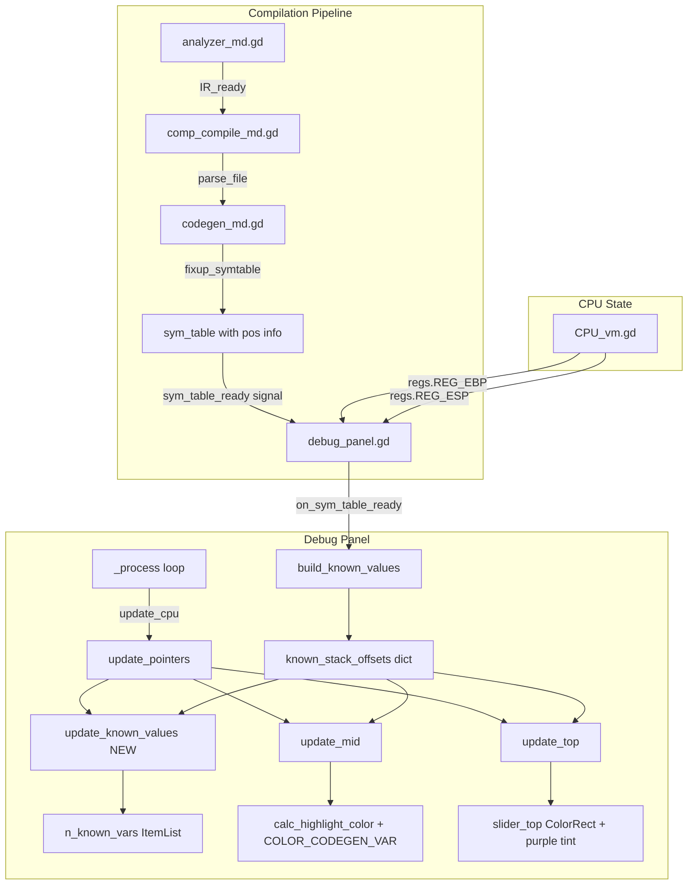

# Implementation Plan: Debug Panel "Pointers" Tab - Codegen Known Values Display

## 1. Current State Analysis

### 1.1 Debug Panel "Pointers" Tab

The debug panel (`debug_panel.gd`) lives as a child of `win_ed_dbg.tscn` and is connected to the editor via `Editor.gd:30`:

```gdscript
$window_debug/debug_panel.setup(dict2);
```

The **pointers tab** is configured in `debug_panel.tscn:47-124` with the following structure:

| Node Path | Type | Purpose |
|---|---|---|
| `V/TabContainer/pointers` | `VBoxContainer` | Tab container for the "pointers" tab |
| `.../slider_top` | `Control` | **Top bar** - shows interpreted values (uint32, float, etc.) as colored `ColorRect` overlays |
| `.../slider_mid` | `ItemList` (16 columns) | **Middle bar** - shows raw hex byte values at `[base-8 .. base+7]` with background highlight |
| `.../slider_bot` | `ItemList` | **Bottom bar** - currently unused (empty, no logic) |
| `.../H/sb_addr` | `SpinBox` | Base address selector for the memory range |
| `.../H/ob_view` | `OptionButton` | View type selector: char, uint8, sint8, uint32, sint32, float32, double |
| `.../H/sb_offs` | `SpinBox` | Offset within the view |

**Current rendering logic** (`debug_panel.gd:359-482`):
- `update_pointers()` → calls `update_mid()` and `update_top()` when `perf.pointers` allows
- `update_mid()`: Populates 16 `slider_mid` items (indices 0-15, mapping to `base-8` through `base+7`). Each item shows the hex byte value. Background color is computed by `calc_highlight_color(addr)`.
- `calc_highlight_color(addr)`: Blends two colors based on:
  - Whether `addr` equals a known IP (dark red) or EBP (dark green)
  - Whether `addr` falls in range `[EBP+1..EBP+5)` (green, saved EBP/IP area)
  - Whether `addr` falls in range `[EBP+5..EBP+9)` (red, saved IP area)
  - Whether `addr` equals `REG_ESP` (cyan)
- `update_top()`: Renders `ColorRect` overlays showing interpreted multi-byte values at the address range. Removes and recreates all children each frame. Uses alternating dark colors for even/odd groups.

**Current highlight colors (stack frame based)**:

| Condition | Color | Blended |
|---|---|---|
| EBP saved area `[EBP+1..EBP+5)` | `GREEN` | lerp(Black, 0.35,0,0, 0.5) |
| IP saved area `[EBP+5..EBP+9)` | `RED` | lerp(Black, 0.35,0,0, 0.5) |
| addr == EBP | `Color(0, 0.23, 0, 1)` | lerp(Black, 0,0.23,0, 0.5) |
| addr == IP | `Color(0.35, 0, 0, 1)` | lerp(Black, 0.35,0,0, 0.5) |
| addr == ESP | `CYAN` | lerp(Black, CYAN, 0.5) |

### 1.2 Codegen's Known Values (`codegen_md.gd`)

The codegen tracks ALL symbols in the `all_syms` dictionary (keyed by `ir_name`), populated during `deserialize()`:

```gdscript
# Lines 90-94: all_syms population
for key in IR.code_blocks: all_syms[key] = IR.code_blocks[key];
for key in IR.scopes:
    var scope = IR.scopes[key];
    for val in scope.vars: all_syms[val.ir_name] = val;
    for val in scope.funcs: all_syms[val.ir_name] = val;
```

**Variable allocation** (`allocate_vars()` + `allocate_value()`, lines 642-698):
- **Global scope**: Variables get `storage = {"type": "global", "pos": 0}`, emitted as labels
- **Local scope**: Variables get `storage = {"type": "stack", "pos": pos}` where:
  - `pos` starts at `to_local_pos(0)` = `-3` and decrements by `data_size` (typically 4)
  - Args get `to_arg_pos(0)` = `9` and increment by `data_size`
  - This means: stack positions are EBP-relative offsets
- **Immediates**: Values stored inline, `storage = "NULL"` until allocated

**Stack frame layout** (relative to EBP):

| Offset Range | Contents |
|---|---|
| `EBP + 1` | Saved EBP (4 bytes) |
| `EBP + 5` | Saved IP (4 bytes) |
| `EBP + 9` | First argument |
| `EBP + 13` | Second argument |
| ... | ... |
| `EBP - 3` | First local variable |
| `EBP - 7` | Second local variable |
| ... | ... |

**Fixup pipeline** (`fixup_symtable()`, lines 764-783):
- Called after codegen in `comp_compile_md.gd:34`
- For each symbol, sets `val.pos = {"type": "stack", "pos": sym.storage.pos}` or `{"type": "global", "lbl": val.ir_name}`
- Works on `analyzer.sym_table`, which has `{global: {...}, funcs: {func_ir_name: {user_name, args: [...], vars: [...], constants: [...]}}}`

**Signal flow**:

```
analyzer.analyze()  ──IR_ready──>  comp_compile_md  ──parse_file()──>  codegen
                                                                          │
                                                                          ▼
                                                                  fixup_symtable()
                                                                          │
                                                                          ▼
                                                              sym_table_ready.emit()
                                                                          │
                                                                          ▼
                                                          debug_panel.on_sym_table_ready()
                                                                    sets cur_sym_table
```

The `cur_sym_table` in `debug_panel.gd:78` is currently used **only** by `update_HL_locals()` (line 854), which reads per-function args/vars and displays their values by reading `EBP + val.pos.pos`.

### 1.3 Memory View (`Memory.gd`)

`Memory.gd` renders memory regions as hex bytes in a `TextEdit`:
- `update_mem_view()`: Iterates from `start` to `end` in 8-byte steps
- Each byte's color comes from the **shadow memory** (`shadow_at + addr`), using `shadow_colors` dict
- Shadow colors distinguish: UNUSED (gray), DATA (yellow), CMD_HEAD (green), CMD_TAIL (dark green), etc.
- The right-hand annotation shows disassembly or data interpretation based on shadow bytes
- The bottom bar (`slider_top` in the debug panel) is NOT in Memory.gd — it's in the pointers tab of the debug panel

### 1.4 Key Insight: Where to Make Changes

The "pointers" tab and the `slider_top`/`slider_mid` rendering are all in **`debug_panel.gd`**. The `cur_sym_table` data is already available in the debug panel. The memory view (`Memory.gd`) is a separate tab in `main.tscn` and shows shadow-byte-colored hex dumps. The feature request focuses on the **debug panel's pointers tab** specifically, not the main memory view.

---

## 2. Data Structure Design

### 2.1 Flat Known-Values Lookup Table

**Purpose**: Provide O(1) lookup from an address to all known values that occupy that byte.

**Location**: Add as a member variable in `debug_panel.gd`.

**Structure**:

```gdscript
# Maps: function_ir_name -> {stack_offset -> [value_info, ...]}
# Where value_info = {user_name, ir_name, is_array, array_size, func_name}
var known_values_by_func: Dictionary = {}
# OR flattened:
# Maps: absolute_address (EBP + offset) -> [value_info, ...]
var known_values_by_addr: Dictionary = {}
```

Since the feature spec says "It doesn't matter which function the values belong to", a **flattened address-based dictionary** is simpler. However, since EBP changes at runtime, we need a **relative offset** dictionary keyed by `(ebp_offset)` that we resolve to absolute addresses each frame based on the current `REG_EBP`.

**Recommended structure**:

```gdscript
# Maps: stack_offset (int, e.g. -3, -7, 9, 13) -> [value_info, ...]
var known_stack_offsets: Dictionary = {}
# where value_info = {user_name: String, ir_name: String, size: int, is_array: bool}
```

### 2.2 Building the Lookup

On `on_sym_table_ready()`:

```gdscript
func on_sym_table_ready(sym_table) -> void:
    cur_sym_table = sym_table
    build_known_values()  # NEW

func build_known_values():
    known_stack_offsets.clear()
    if not cur_sym_table: return
    
    for func_name in cur_sym_table.funcs:
        var fun = cur_sym_table.funcs[func_name]
        for cat in [fun.args, fun.vars]:  # include constants?
            for val in cat:
                if val.pos.type == "stack":
                    var offset = val.pos.pos  # EBP-relative offset
                    if offset not in known_stack_offsets:
                        known_stack_offsets[offset] = []
                    var size = 4
                    if val.is_array:
                        size = 4 * int(val.array_size)
                    known_stack_offsets[offset].append({
                        "user_name": val.user_name,
                        "ir_name": val.ir_name,
                        "size": size,
                        "is_array": val.is_array,
                        "func_name": func_name
                    })
```

### 2.3 Size Consideration for Arrays

Arrays occupy multiple bytes (4 × array_size). For highlight purposes, any byte in `[offset, offset + size)` should be highlighted. The lookup should return all value_infos whose range covers a given byte offset.

---

## 3. Signal/Event Flow

### 3.1 Current Flow (No Changes Needed)

The existing signal path already delivers the symbol table to the debug panel:

1. `comp_compile_md.gd:35` — `sym_table_ready.emit(analyzer.sym_table)`
2. `debug_panel.gd:851` — `on_sym_table_ready()` sets `cur_sym_table`
3. The signal must be connected somewhere — but searching shows no `.connect()` call found. **This is likely connected via the Godot editor's signal connection UI** or through the `win_ed_dbg` scene. Verify and add if missing.

### 3.2 Required Addition

When `cur_sym_table` is set (in `on_sym_table_ready()`), trigger building the `known_stack_offsets` lookup table and prime the pointers perf limiter:

```gdscript
func on_sym_table_ready(sym_table) -> void:
    cur_sym_table = sym_table
    build_known_values()           # NEW
    perf.pointers.prime()          # NEW - refresh display
```

### 3.3 Runtime Updates

At runtime (each frame), `update_pointers()` already runs via the perf limiter. It calls `update_mid()` and `update_top()`. We need to:
- Add a new function `update_known_values_view()` or extend `update_pointers()`
- In `calc_highlight_color()`, add the new codegen highlight logic
- In `update_top()`, add the new highlight color to the bottom bar

No new signals are needed — the data flows through the existing `_process()` → `update_cpu()` → `update_pointers()` chain.

---

## 4. UI Changes

### 4.1 Pointers Tab - New "Known Values" Section

Add a split view in the pointers tab:

**Option A**: A new `ItemList` or `Tree` control added BELOW the slider area, showing all known stack variables and their current values.

**Option B**: Replace the current slider view with a tabbed or split view.

**Recommended: Option A** — Add below the existing slider, keeping backward compatibility.

**Scene changes** (`debug_panel.tscn`):

Add after `V/TabContainer/pointers/H`:

```tscn
[node name="known_vars" type="ItemList" parent="V/TabContainer/pointers"]
layout_mode = 2
size_flags_vertical = 3
max_columns = 4
same_column_width = true
fixed_column_width = 0
```

Alternatively, use a `Tree` control for hierarchical display (function → variables). An `ItemList` with 4 columns is simpler and matches the existing pattern.

**Columns for ItemList**:

| Column | Content |
|---|---|
| 0 | Variable name (`user_name`) |
| 1 | EBP offset (e.g., `-3`, `+9`) |
| 2 | Current value (read from memory: `read32(EBP + offset)`) |
| 3 | Function name |

**Script changes** (`debug_panel.gd`):

Add `@onready`:

```gdscript
@onready var n_known_vars = $V/TabContainer/pointers/known_vars   # or ItemList node
```

### 4.2 Selecting a Known Value to View in the Slider

When a user clicks on a known value in the list, the slider should jump to that address. Connect `item_selected` on the new list:

```gdscript
func _on_known_vars_item_selected(index: int) -> void:
    # Look up the item data and set sb_addr to the absolute address
    var var_info = known_vars_display_list[index]
    var addr = cpu.regs[ISA.REG_EBP] + var_info.offset
    n_sb_addr.value = addr
    perf.pointers.prime()
```

### 4.3 "Pointers" Tab Display of Known Values

The `update_known_values()` function:

```gdscript
func update_known_values():
    if not perf.pointers.run(0): return  # reuse same perf limiter
    if not n_known_vars: return
    n_known_vars.clear()
    
    var cur_ebp = cpu.regs[ISA.REG_EBP]
    known_vars_display_list.clear()
    
    for offset in known_stack_offsets:
        for info in known_stack_offsets[offset]:
            var addr = cur_ebp + offset
            var val = read32(addr) if info.size >= 4 else bus.readCell(addr)
            
            var idx = n_known_vars.add_item(info.user_name)
            n_known_vars.set_item_text(idx, 1, "EBP%+d" % offset)
            n_known_vars.set_item_text(idx, 2, str(val))
            n_known_vars.set_item_text(idx, 3, info.func_name)
            
            known_vars_display_list.append(info)
```

---

## 5. Highlight Logic for Bottom Bar

### 5.1 New Highlight Color in `slider_mid`

Add a new color entry in `calc_highlight_color()` for bytes whose EBP-relative offset falls within a known variable's range:

```gdscript
const COLOR_CODEGEN_VAR = Color(0.3, 0.0, 0.5, 1.0)  # Purple/magenta for codegen vars

func calc_highlight_color(addr):
    var item1_col = Color.BLACK
    var item2_col = Color.BLACK
    var item3_col = Color.BLACK   # NEW: third layer for codegen vars
    
    # ... existing stack frame highlighting logic ...
    
    # NEW: Codegen known values highlighting
    var cur_ebp = cpu.regs[ISA.REG_EBP]
    var offset = addr - cur_ebp
    if offset in known_stack_offsets:
        item3_col = COLOR_CODEGEN_VAR
    
    # Three-way blend
    var tmp = item1_col.lerp(item2_col, 0.5)
    return tmp.lerp(item3_col, 0.33)  # blend in codegen color with lower weight
```

### 5.2 New Highlight in `slider_top` (Bottom Bar)

In `update_top()`, when creating `ColorRect` overlays, add a check for whether any bytes in the aggregated range belong to known codegen values:

```gdscript
func update_top():
    # ... existing cleanup and setup ...
    
    for i in range(n_views):
        # ... existing position calculation ...
        
        # NEW: Check if this view range contains known codegen variables
        var has_codegen_var = false
        for b in range(view_size):
            var byte_addr = pos + b
            var ebp_offset = byte_addr - cpu.regs[ISA.REG_EBP]
            if ebp_offset in known_stack_offsets:
                has_codegen_var = true
                break
        
        var view_box = ColorRect.new()
        if has_codegen_var:
            view_box.color = Color(0.3, 0.0, 0.5, 0.3)  # Purple tint for codegen vars
        else:
            view_box.color = col_odd if not is_even else col_even
        
        # ... rest of existing rendering ...
```

### 5.3 `slider_bot` Usage

The currently unused `slider_bot` `ItemList` could be repurposed to show a color legend or additional metadata about the codegen variables. For example, it could display: "Known Vars: EBP-3(x) EBP-7(y) EBP+9(z)" with color swatches.

### 5.4 Shadow Memory Alternative (for Memory.gd)

If the feature is also desired in the main Memory tab (`Memory.gd`), a new shadow memory type should be added:

In `lang_zvm.gd`:
```gdscript
const SHADOW_CODEGEN_VAR = 9  # NEW
```

In `Memory.gd`, add to `shadow_colors`:
```gdscript
ISA.SHADOW_CODEGEN_VAR: Color(0.3, 0.0, 0.5, 1.0),  # Purple
```

And in the compilation pipeline (`comp_build.gd`), after codegen runs, populate shadow bytes for the stack region with `SHADOW_CODEGEN_VAR` at offsets corresponding to known variables.

**However**, this is more complex because it requires the compilation pipeline to know about the stack frame at upload time. The simpler approach is to keep the highlighting only in the debug panel's pointers tab, which has direct access to both `cur_sym_table` and `cpu.regs[REG_EBP]`.

---

## 6. Implementation Steps

### Step 1: Verify Signal Connection

- [ ] Open `win_ed_dbg.tscn` or `Editor.gd` to check if `sym_table_ready` from `comp_compile_md` is connected to `debug_panel.on_sym_table_ready`
- [ ] If not connected, add the connection (either in scene or via code in `Editor.gd`)

### Step 2: Add Data Structures to `debug_panel.gd`

- [ ] Add member variable:
  ```gdscript
  var known_stack_offsets: Dictionary = {}   # offset -> [info, ...]
  var known_vars_display_list: Array = []     # for click-to-navigate
  const COLOR_CODEGEN_VAR = Color(0.3, 0.0, 0.5, 1.0)
  ```
- [ ] Implement `build_known_values()`:
  - Iterate `cur_sym_table.funcs`
  - For each function, iterate `args` and `vars`
  - For each with `pos.type == "stack"`, add to `known_stack_offsets[pos.pos]`
  - Include `size` info for array variables

### Step 3: Extend `on_sym_table_ready()`

- [ ] Call `build_known_values()` after setting `cur_sym_table`
- [ ] Call `perf.pointers.prime()` to refresh

### Step 4: Add the Known Values UI to `debug_panel.tscn`

- [ ] Add a `Label` node: "Known Codegen Values" or "Stack Variables"
- [ ] Add an `ItemList` node named `known_vars` inside `V/TabContainer/pointers`
- [ ] Set properties: `max_columns = 4`, `same_column_width = true`, `size_flags_vertical = 3`
- [ ] Add `@onready var n_known_vars` in `debug_panel.gd`
- [ ] Implement `update_known_values()` in the pointers update path

### Step 5: Integrate into Update Loop

- [ ] In `update_cpu()` or `update_pointers()`, call `update_known_values()`
- [ ] Handle perf limiting (reuse existing `perf.pointers` or create a new perf slot)

### Step 6: Add Highlight in `calc_highlight_color()`

- [ ] In `calc_highlight_color()`, compute `offset = addr - cur_ebp`
- [ ] Check `offset in known_stack_offsets` and apply `COLOR_CODEGEN_VAR` as a third blending layer
- [ ] For arrays, check if `offset` falls within `[base_offset, base_offset + size)`

### Step 7: Add Highlight in `update_top()` (Bottom Bar)

- [ ] After computing `pos` for each view, check if any byte `[pos, pos+view_size)` overlaps with known codegen var ranges
- [ ] Apply purple tint to the `ColorRect` when overlap exists

### Step 8: Add Click-to-Navigate

- [ ] Connect `item_selected` signal from `n_known_vars` → new handler
- [ ] Handler computes absolute address from `cur_ebp + offset` and sets `n_sb_addr.value`
- [ ] Call `perf.pointers.prime()`

### Step 9: Optional: `slider_bot` Legend

- [ ] If `slider_bot` shows nothing, populate it with a color legend
- [ ] Add entries explaining each highlight color (stack/IP/codegen/ESP)

### Step 10: Testing and Edge Cases

- [ ] Test with empty symbol table (no codegen vars → no purple highlighting)
- [ ] Test with global-only variables (no stack vars → no purple highlighting)
- [ ] Test with array variables (multi-byte range check)
- [ ] Test with multiple functions on the call stack (all known values from all functions should be highlighted)
- [ ] Test performance with many variables (use perf limiter)
- [ ] Test the click-to-navigate interaction
- [ ] Test `slider_bot` color legend

---

## 7. Risks and Considerations

### 7.1 Performance

- **Per-frame iteration**: `update_known_values()` iterates all known stack offsets each frame. With the perf limiter at `1.0` (once per second), this is acceptable.
- **calc_highlight_color()** is called 16 times per frame (once per `slider_mid` item). Dictionary lookup by offset is O(1). Acceptable.
- **update_top()** recreates `ColorRect` children each frame. Checking each byte for codegen overlap adds O(view_size) per view. For views of up to 8 bytes and ~4 views, this is ~32 extra operations. Acceptable.
- **Mitigation**: If many known values (hundreds), consider using a sorted array and binary search instead of dictionary iteration.

### 7.2 Edge Cases

| Edge Case | Behavior |
|---|---|
| No symbol table loaded | `known_stack_offsets` is empty, no purple highlighting |
| EBP changes (function call) | `calc_highlight_color()` recalculates each frame using current `REG_EBP` |
| Stack variable overlap (same offset) | Multi-value entries in `known_stack_offsets[offset]`, both shown |
| Array variables | `size` field covers multiple bytes, check range `[offset, offset+size)` |
| Global variables | Not on stack, not included in `known_stack_offsets` |
| Function args vs locals | Both stored in `known_stack_offsets`, distinguished by `user_name` |
| Very deep stack with same EBP offsets | Possible if multiple functions have vars at same EBP offset (EBP changes per frame, so absolute addresses differ; offset-based lookup works across all functions) |

### 7.3 Testing Approach

1. **Unit testing in isolation**: Compile a miniderp program with known local variables. Open the debug panel. Verify:
   - Known values list populates with correct names and offsets
   - Purple highlighting appears in `slider_mid` at correct byte positions
   - `slider_top` shows purple tint for aggregated views containing known vars
   - Clicking a known value navigates the slider to that address

2. **Cross-function testing**: Write a program with `main()` and `helper()` functions, each with local vars. Step through calls. Verify:
   - Known values from both functions appear in the list
   - Highlighting adjusts as EBP changes with function calls/returns

3. **Edge case testing**: Test with:
   - Empty program (no variables)
   - Program with only global variables
   - Program with arrays
   - Program with many local variables

### 7.4 Dependencies

- **`cur_sym_table` must be populated** before the known values view can work
- The `sym_table_ready` signal must be connected from `comp_compile_md` to `debug_panel.on_sym_table_ready`
- The memory must contain valid data at the addresses pointed to by EBP+offset

### 7.5 Future Considerations

- **Adding a "watch" feature**: Users could pin specific variables to always be visible
- **Integration with main Memory tab**: Extend shadow memory to include codegen variable markers
- **Type-aware display**: Instead of always reading 4 bytes, use the actual variable type to determine display format (sint8, uint32, string, etc.)

---

## Architecture Diagram



## Summary of Files to Modify

| File | Changes |
|---|---|
| `debug_panel.gd` | Add `known_stack_offsets`, `build_known_values()`, `update_known_values()`, modify `calc_highlight_color()`, modify `update_top()`, connect `n_known_vars`, add click handler |
| `debug_panel.tscn` | Add `known_vars` ItemList node, add Label |
| `comp_compile_md.gd` | Verify `sym_table_ready` signal is connected to debug panel (may already be connected via editor/scene) |
