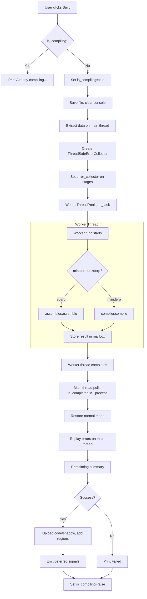

# Threaded Compilation Implementation Plan

**Goal**: Move MiniDerp compilation and ZDerp assembly into a Godot `WorkerThreadPool` worker thread so the UI remains responsive. Console shows progress reports like `"tokenizing 100% (2 seconds)"`, `"parsing 100% (10 seconds)"`, etc.

**Constraint**: Minimal set of changes — no refactoring of the entire pipeline.

---

## 1. New File: `class_ThreadSafeErrorCollector.gd`

A `RefCounted` class that replaces `ErrorReporter` for worker threads. It accumulates errors as data records for replay on the main thread.

### API Design

```gdscript
# class_ThreadSafeErrorCollector.gd
extends RefCounted
class_name ThreadSafeErrorCollector

# Accumulated errors: Array[Dictionary]
# Each dict: {msg:String, line_idx:int, col:int, line_text:String, loc:LocationRange, is_error:bool}
var errors:Array[Dictionary] = []
# Current context for error pinpointing
var context = null  # Token | Iter | LocationRange | null

# Matches ErrorReporter.error(msg) signature
func error(msg:String) -> void:
	errors.append({
		"msg": msg,
		"line_idx": _get_line_idx(),
		"col": _get_col(),
		"line_text": _get_line_text(),
		"loc": _get_loc(),
		"is_error": true,
	})

# Matches ErrorReporter.context = xxx pattern
func set_context(ctx) -> void:
	context = ctx

# Helper to extract line/col from context
func _get_line_idx() -> int:
	if context is Token:
		return context.loc.begin.line_idx if context.loc else 0
	if context is Iter:
		if context.pos < len(context.tokens):
			return context.tokens[context.pos].loc.begin.line_idx
	if context is LocationRange:
		return context.begin.line_idx
	return 0

func _get_col() -> int:
	# similar extraction from context
	...

func _get_line_text() -> String:
	# similar extraction from context
	...

func _get_loc():
	if context is Token: return context.loc
	if context is LocationRange: return context
	return null
```

### Design Decisions

- **No `push_error()` calls** — `push_error()` is thread-safe in Godot 4.x, but it clutters the console. The collector stores errors as data for controlled replay.
- **No `sig_highlight_line`** — highlighting is deferred to main thread replay.
- **No `proxy` dependency** — the collector does not need a `proxy.user_error()` call. It simply records the error.
- **`context` is a plain reference** — `Token`, `Iter`, and `LocationRange` are all `RefCounted` and thus safe to reference from worker threads.

---

## 2. Changes to `scenes/comp_asm_zd.gd`

### 2a. Add `assemble_threadsafe(input:Dictionary, error_collector:ThreadSafeErrorCollector) -> Dictionary`

New method alongside the existing `assemble()`:

```gdscript
func assemble_threadsafe(input:Dictionary, error_collector:ThreadSafeErrorCollector) -> Dictionary:
	# 1. Call the existing assemble() but with error_collector override
	# 2. Do NOT emit tokens_ready — return tokens in result dict
	# 3. Return {chunk:Chunk, tokens:Array[Token], timings:{stage:elapsed_ms}}
	
	var t_start = Time.get_ticks_msec()
	# Temporarily swap erep with the collector
	var old_erep = erep
	erep = error_collector  # Duck-typing: collector has error() and context setter
	assemble(input)  # This will use error_collector instead of erep
	erep = old_erep  # restore
	
	var result = {
		"chunk": null,
		"tokens": [],
		"timings": {"total": Time.get_ticks_msec() - t_start}
	}
	if error_code == "":
		result.chunk = output_chunk()
		result.chunk = link_internally(result.chunk)
	result.tokens = output_tokens.duplicate()
	return result
```

**Alternative (simpler)**: Add a settable `var error_collector:ThreadSafeErrorCollector = null` field. Modify `user_error()`, `error()` calls, and `tokens_ready.emit()` to check `if error_collector:` first.

### 2b. Modified lines in `assemble()` 

| Line | Change |
|------|--------|
| `assemble():78` | `erep.proxy = self` → skip if `error_collector != null` |
| `assemble():102` | `tokens_ready.emit(output_tokens)` → only emit if `error_collector == null` (main thread), else skip |
| `assemble():111-112` | `erep.context = lbl_tok; erep.error(...)` → use `error_collector.set_context(); error_collector.error()` if present |
| Various `erep.error()` calls | Guard with `if error_collector: error_collector.error(...) else: erep.error(...)` |
| Various `erep.context = ...` | Guard with `if error_collector: error_collector.set_context(...) else: erep.context = ...` |

### 2c. No changes needed to internal methods

Methods like `tokenize()`, `process()`, `parse_label()`, `parse_db()`, `parse_command()`, `emit8()`, `emit32()` etc. all use `erep.error()` and `erep.context =` — these will be redirected by the guard checks.

---

## 3. Changes to `scenes/comp_compile_md.gd`

### 3a. Add `compile_threadsafe(input:Dictionary, error_collector:ThreadSafeErrorCollector) -> Dictionary`

```gdscript
func compile_threadsafe(input:Dictionary, error_collector:ThreadSafeErrorCollector) -> Dictionary:
	var timings = {}
	var t_stage = Time.get_ticks_msec()
	
	# Pass error_collector to all sub-stages
	tokenizer.error_collector = error_collector
	parser.error_collector = error_collector
	analyzer.error_collector = error_collector
	
	# Tokenize
	tokenizer.cur_path = cur_path
	input["tokens"] = tokenizer.tokenize(input)
	timings["tokenizing"] = Time.get_ticks_msec() - t_stage
	if error_collector.errors.size() > 0:
		return _build_error_result(input, timings, error_collector)
	if not input.tokens:
		return _build_error_result(input, timings, error_collector)
	
	# Parse
	t_stage = Time.get_ticks_msec()
	input["ast"] = parser.parse(input)
	timings["parsing"] = Time.get_ticks_msec() - t_stage
	if error_collector.errors.size() > 0:
		return _build_error_result(input, timings, error_collector)
	if not input.ast:
		return _build_error_result(input, timings, error_collector)
	
	# Analyze
	t_stage = Time.get_ticks_msec()
	input["IR"] = analyzer.analyze(input)
	timings["analyzing"] = Time.get_ticks_msec() - t_stage
	if error_collector.errors.size() > 0:
		return _build_error_result(input, timings, error_collector)
	
	# Codegen — read IR from file (or pass in-memory)
	t_stage = Time.get_ticks_msec()
	input.filename = _get_temp_ir_path()
	input["assy"] = codegen.parse_file(input)
	timings["codegen"] = Time.get_ticks_msec() - t_stage
	if error_collector.errors.size() > 0:
		return _build_error_result(input, timings, error_collector)
	
	# Fixup sym table
	codegen.fixup_symtable(analyzer.sym_table)
	
	# Return results as data (no signals, no file save)
	return {
		"success": true,
		"tokens": tokenizer.output_tokens.duplicate(),
		"ast": input.ast,
		"ir": input.IR,
		"assembly_text": input.assy,
		"sym_table": analyzer.sym_table,
		"errors": error_collector.errors.duplicate(),
		"timings": timings,
	}

func _build_error_result(input:Dictionary, timings:Dictionary, error_collector:ThreadSafeErrorCollector) -> Dictionary:
	return {
		"success": false,
		"errors": error_collector.errors.duplicate(),
		"timings": timings,
	}

# Thread-safe temp path for IR file
func _get_temp_ir_path() -> String:
	return ProjectSettings.globalize_path("user://ir_temp_" + str(Time.get_ticks_usec()) + ".txt")
```

### 3b. Skip all signal emissions

| Signal | Change |
|--------|--------|
| `tokens_ready.emit()` | Only emit if `error_collector == null` |
| `parse_ready.emit()` | Only emit if `error_collector == null` |
| `IR_ready.emit()` | Only emit if `error_collector == null` |
| `sym_table_ready.emit()` | Only emit if `error_collector == null` |
| `open_file_request.emit("a.zd")` | Skip — file is saved on main thread from result |
| `sig_user_error.emit()` | Skip — errors go to error_collector |

### 3c. Handle file save on main thread

The current code at line 37-38:
```gdscript
save_file(input.assy, "a.zd");
open_file_request.emit("a.zd");
```

In the worker path, return `input.assy` in the result dict. The main thread callback (`_on_build_thread_complete`) will call `save_file()` and `Editor.switch_to_file("a.zd")`.

---

## 4. Changes to Pipeline Stages

Each of these files needs a small, targeted change: add an `error_collector` field and redirect error reporting.

### 4a. `scenes/md_tokenizer.gd`

**Add field**:
```gdscript
var error_collector:ThreadSafeErrorCollector = null
```

**Modify lines**:

| Line(s) | Change |
|---------|--------|
| `tokenize():57` | `erep.proxy = self` → `if not error_collector: erep.proxy = self` |
| `tokenize():74` | `tokens_ready.emit(output_tokens)` → `if not error_collector: tokens_ready.emit(output_tokens)` |
| `get_word_at():115` | `erep.error(...)` → `if error_collector: error_collector.error(...) else: erep.error(...)` |
| `include_file():132` | Same guard |
| `resolve_char_tokens():233` | Same guard |
| `user_error():50` | Already emits signal — guard with `if not error_collector: sig_user_error.emit(msg)` |
| `erep.proxy = self` (any) | Guard with `if not error_collector:` |

### 4b. `scenes/parser_md.gd`

**Add field**:
```gdscript
var error_collector:ThreadSafeErrorCollector = null
```

**Modify lines**:

| Line(s) | Change |
|---------|--------|
| `parse():43` | `erep.proxy = self` → `if not error_collector: erep.proxy = self` |
| `parse():71` | `sig_parse_ready.emit(stack)` → `if not error_collector: sig_parse_ready.emit(stack)` |
| `parse():81-85` | Error handling uses `sig_user_error.emit()` and `erep.error()` → redirect to collector if present |
| `user_error():8` | `sig_user_error.emit(msg)` → `if error_collector: error_collector.error(msg) else: sig_user_error.emit(msg)` |
| Any `erep.error()` | Guard with collector check |
| Any `erep.context =` | Guard with collector check |

### 4c. `scenes/analyzer_md.gd`

**Add field**:
```gdscript
var error_collector:ThreadSafeErrorCollector = null
```

**Modify lines**:

| Line(s) | Change |
|---------|--------|
| `analyze():73` | `erep.proxy = self` → `if not error_collector: erep.proxy = self` |
| `analyze():78` | `IR_ready.emit(IR.IR)` → `if not error_collector: IR_ready.emit(IR.IR)` |
| `analyze():80` | `IR.to_file("IR.txt")` → `IR.to_file(_get_temp_ir_path())` if `error_collector` (use a settable temp path) |
| `user_error():85-89` | Instead of signal emit + assert, if collector present: `error_collector.error(msg); return` |
| `internal_error():91-93` | `erep.error(msg)` → redirect to collector if present |
| Any `erep.error()` / `erep.context =` | Guard with collector check |

**Important**: `analyzer_md` uses `@export var IR:Node` — this is a scene reference to `ir_md.gd`. The `IR` node's methods (`clear_IR()`, `save_variable()`, `emit_IR()`, etc.) operate on data (Dictionaries, Arrays) inside a `RefCounted` object (`IR.IR`). This is okay as long as:
- The `IR` node itself is NOT accessed from a worker thread (its `_ready()`, `_process()` etc.)
- Only data methods are called

**BUT**: `IR` is a child node of the scene tree. Calling `IR.clear_IR()` from a worker thread might cause issues because `IR.code_blocks = {}` sets a property. However, since the IR data is self-contained (Dictionaries, Arrays, RefCounted objects), this should be safe if no editor/scene operations are triggered.

**Alternative (safer)**: Create a standalone `RefCounted` IR builder for the worker path, or have the analyzer create a fresh Dictionary structure in-memory without using the `ir_md.gd` Node instance. **However**, to minimize changes, we can keep using the Node's methods but ensure no signal/editor operations are triggered.

### 4d. `scenes/codegen_md.gd`

**Add field**:
```gdscript
var error_collector:ThreadSafeErrorCollector = null
```

**Modify lines**:

| Line(s) | Change |
|---------|--------|
| `generate():206` | `locations_ready.emit(cur_assy_block.loc_map)` → `if not error_collector: locations_ready.emit(...)` |

The codegen doesn't use `erep` at all — it only emits `locations_ready`. This is the simplest change.

---

## 5. Changes to `scenes/comp_build.gd`

This is the orchestrator that integrates with `WorkerThreadPool`.

### 5a. Add `is_compiling` guard

```gdscript
var is_compiling = false
```

### 5b. Modify `create_compile_task()` — new method

```gdscript
func create_compile_task() -> Callable:
    # Capture all data needed by the worker thread
    var text = cur_efile.get_text()
    var filename = cur_efile.file_name
    var path = cur_efile.path
    var lang = cur_lang
    
    # Create the error collector
    var error_collector = ThreadSafeErrorCollector.new()
    
    # Return a callable that can run on a worker thread
    return func() -> Dictionary:
        var timings = {}
        
        if lang == "zderp":
            return _worker_assemble(text, filename, path, error_collector)
        elif lang == "miniderp":
            return _worker_compile_miniderp(text, filename, path, error_collector)
        else:
            return {"success": false, "errors": [], "timings": {}}
```

### 5c. Worker functions

```gdscript
func _worker_assemble(text:String, filename:String, path:String, 
                      error_collector:ThreadSafeErrorCollector) -> Dictionary:
    var result = n_assembler.assemble_threadsafe({
        "text": text,
        "filename": filename,
        "path": path,
    }, error_collector)
    return result

func _worker_compile_miniderp(text:String, filename:String, path:String,
                               error_collector:ThreadSafeErrorCollector) -> Dictionary:
    n_compiler.reset()
    n_compiler.cur_path = path.get_base_dir()
    var compiler_input = {"text": text, "filename": filename}
    return n_compiler.compile_threadsafe(compiler_input, error_collector)
```

### 5d. Modify `_on_build_index_pressed()`

```gdscript
func _on_build_index_pressed(index):
    if index == 0: # "compile"
        if is_compiling:
            Editor.print_console("Already compiling...", Color.YELLOW)
            return
        is_compiling = true
        
        n_VM.reset()
        await Editor.save()
        Editor.clear_console()
        Editor.print_console("Starting compilation in worker thread...", Color.GRAY)
        
        var task = create_compile_task()
        # Schedule the callback to run on main thread after worker completes
        WorkerThreadPool.add_task(task, true, "compile_task")
        # Use call_deferred to poll for completion
		# Actually: WorkerThreadPool doesn't have a native completion callback.
		# We need a different approach:
		_start_polling_compile()
```

### 5e. Polling / Completion Pattern

Godot's `WorkerThreadPool.add_task()` does NOT have a built-in completion callback. We need either:

**Option A (Recommended): Use a simple `Thread` with `call_deferred`**

```gdscript
var compile_thread: Thread
var compile_result: Dictionary = {}
var compile_complete: bool = false

func _start_compile_thread():
    compile_thread = Thread.new()
    compile_complete = false
    var task = create_compile_task()
    compile_thread.start(func():
        var result = task.call()
        # Store result
        compile_result = result
        compile_complete = true
        # Use call_deferred to return to main thread
        call_deferred("_on_compile_thread_done")
    )

func _on_compile_thread_done():
    compile_thread.wait_to_finish()
    is_compiling = false
    _process_compile_result(compile_result)
```

**Option B: Manual polling in `_process()`**

```gdscript
func _process(_delta):
    if compile_complete:
        compile_complete = false
        _on_compile_thread_done()
```

**But the user requested `WorkerThreadPool` specifically.** Let's use it properly:

```gdscript
var compile_task_id: int = -1

func _start_compile_worker():
	var callable = create_compile_task()
	compile_task_id = WorkerThreadPool.add_task(callable)
	# Poll in _process using WorkerThreadPool.is_task_completed()
	set_process(true)

func _process(_delta):
	if compile_task_id >= 0 and WorkerThreadPool.is_task_completed(compile_task_id):
		compile_task_id = -1
		is_compiling = false
		set_process(false)
		# At this point the callable has stored results somewhere accessible
		# Since the callable is a lambda that captured variables, the results 
		# need to be stored via call_deferred or a shared Dictionary
```

**Actually, the cleanest approach with WorkerThreadPool:**

```gdscript
# Use a shared RefCounted "mailbox" to pass results back
class CompileMailbox extends RefCounted:
	var result: Dictionary = {}
	var completed: bool = false

func compile_async():
	var mailbox = CompileMailbox.new()
	var text = cur_efile.get_text()
	var filename = cur_efile.file_name
	var path = cur_efile.path
	var lang = cur_lang
	var error_collector = ThreadSafeErrorCollector.new()
	
	var task_id = WorkerThreadPool.add_task(func():
		var result = {}
		if lang == "zderp":
			n_assembler.cur_path = path
			var asm_input = {"text": text, "filename": filename}
			var chunk = n_assembler.assemble(asm_input)
			result = {"chunk": chunk, "success": G.has(chunk)}
		elif lang == "miniderp":
			n_compiler.reset()
			n_compiler.cur_path = path.get_base_dir()
			var compiler_input = {"text": text, "filename": filename}
			var success = n_compiler.compile(compiler_input)
			result = {"success": success}
		mailbox.result = result
		mailbox.completed = true
	), true, "compile_task")
	
	# Poll in _process
	_compile_mailbox = mailbox
	set_process(true)

func _process(_delta):
	if _compile_mailbox and _compile_mailbox.completed:
		_compile_mailbox = null
		set_process(false)
		_process_compile_result(_compile_mailbox.result)
```

**Wait — this approach calls the EXISTING `assemble()` and `compile()` methods which emit signals and use `erep` directly. That defeats the purpose.**

The issue is that `WorkerThreadPool.add_task()` takes a `Callable` that runs on a worker thread. The callable CAN access methods on Nodes — it just can't access the scene tree (adding/removing nodes), signals, or `@export`/`@onready` variables that haven't been set up on that thread.

### The Correct Approach

```gdscript
func _on_build_index_pressed(index):
	if index == 0:
		if is_compiling: return
		is_compiling = true
		
		n_VM.reset()
		await Editor.save()
		Editor.clear_console()
		Editor.print_console("Compiling...")
		
		# Extract data on main thread
		var text = cur_efile.get_text()
		var filename = cur_efile.file_name
		var path = cur_efile.path
		var lang = cur_lang
		var error_collector = ThreadSafeErrorCollector.new()
		
		# Start worker thread
		WorkerThreadPool.add_task(_worker_task.bind(text, filename, path, lang, error_collector), true, "compile_task")
		
		# Store mailbox for polling
		_compile_mailbox_result = {}
		_compile_mailbox_ready = false
		_compile_error_collector = error_collector
		set_process(true)

var _compile_mailbox_result: Dictionary = {}
var _compile_mailbox_ready: bool = false
var _compile_error_collector: ThreadSafeErrorCollector = null

# This runs on a worker thread
func _worker_task(text:String, filename:String, path:String, lang:String, 
				  error_collector:ThreadSafeErrorCollector) -> void:
	# NOTE: We CANNOT access Node methods that modify scene tree here.
	# But we CAN call methods that operate on data.
	# The key insight: n_assembler and n_compiler and their children are Node instances,
	# but calling their data-processing methods is safe as long as no signals are emitted
	# and no scene tree modifications occur.
	
	var result = {}
	if lang == "zderp":
		n_assembler.cur_path = path
		n_assembler.error_collector = error_collector
		var asm_input = {"text": text, "filename": filename}
		var chunk = n_assembler.assemble(asm_input)
		result = {"chunk": chunk, "code": chunk.code if G.has(chunk) else [], 
				  "shadow": chunk.shadow if G.has(chunk) else []}
		result.success = G.has(chunk) and chunk != Chunk.null_val()
	elif lang == "miniderp":
		n_compiler.reset()
		n_compiler.cur_path = path.get_base_dir()
		n_compiler.tokenizer.error_collector = error_collector
		n_compiler.parser.error_collector = error_collector
		n_compiler.analyzer.error_collector = error_collector
		var compiler_input = {"text": text, "filename": filename}
		var success = n_compiler.compile(compiler_input)
		result.success = success
		result.code = []
		result.shadow = []
	
	result.errors = error_collector.errors.duplicate()
	result.timings = {}  # populate from stages
	
	# Store result for main thread pickup
	# NOTE: We cannot use call_deferred from a worker thread.
	# We must use an atomic mechanism or poll.
	_compile_mailbox_result = result
	_compile_mailbox_ready = true

func _process(_delta):
	if _compile_mailbox_ready:
		_compile_mailbox_ready = false
		set_process(false)
		is_compiling = false
		
		var result = _compile_mailbox_result
		var error_collector = _compile_error_collector
		
		# Replay errors
		for err in result.get("errors", []):
			if err.has("loc") and err.loc:
				Editor._on_highlight_line(err.loc)
			Editor._on_cprint(err.msg if "msg" in err else "Error", Color.RED)
		
		# Print timing summary
		var timings = result.get("timings", {})
		for stage in timings:
			var secs = timings[stage] / 1000.0
			Editor.print_console("%s 100%% (%.1f seconds)" % [stage, secs])
		
		# Handle result
		if result.get("success", false):
			Editor.print_console("Compiled successfully")
			var code = result.get("code", [])
			var shadow = result.get("shadow", [])
			if not code.is_empty():
				upload(code)
				upload_shadow(shadow)
				add_stack_region()
				add_screen_region()
				Editor.print_console("Code uploaded to memory")
		else:
			Editor.print_console("Failed to compile", Color.RED)
```

**BUT WAIT**: There's a critical issue. The _worker_task runs on a worker thread but calls `n_assembler.assemble()` and `n_compiler.compile()` which call methods on Node instances. In Godot 4.x, calling methods on Nodes from a worker thread IS allowed as long as:
1. No scene tree operations (add_child, remove_child, etc.)
2. No signal emissions (they queue on the main thread)
3. No property access that triggers setters connected to the scene tree

Since the compiler pipeline stages are data-in/data-out, this should work. But we need to ensure all signal emissions are guarded.

**Simplest approach that definitely works:**

Since all pipeline stages are children of `comp_build` in the scene tree, and they're all already instantiated, we can call their methods from a worker thread as long as:
- We set `error_collector` on each stage before the worker call
- The stages skip signal emissions when `error_collector != null`
- No `@onready` or `@export` vars are accessed during the compile (they're set up in `_ready()`)

Let me revise the approach to be simpler:

### 5f. `_on_build_index_pressed()` — Revised

```gdscript
var _compile_mailbox: Dictionary = {}
var _compile_mailbox_ready: bool = false

func _on_build_index_pressed(index):
    if index == 0:
        if is_compiling: return
        is_compiling = true
        
        n_VM.reset()
        await Editor.save()
        Editor.clear_console()
        Editor.print_console("Compiling...", Color.GRAY)
        
        # Extract data on main thread
        var text = cur_efile.get_text()
        var filename = cur_efile.file_name
        var path = cur_efile.path
        var lang = cur_lang
        var error_collector = ThreadSafeErrorCollector.new()
        
        # Set up error collectors on all pipeline stages (main thread)
        _set_threadsafe_mode(error_collector, true)
        
        # Capture callable with all data
        var worker_callable = func():
            var result = {}
            if lang == "zderp":
                n_assembler.cur_path = path
                n_assembler.error_collector = error_collector
                var asm_input = {"text": text, "filename": filename}
                var chunk = n_assembler.assemble(asm_input)
                result.code = chunk.code.duplicate() if G.has(chunk) else []
                result.shadow = chunk.shadow.duplicate() if G.has(chunk) else []
                result.success = G.has(chunk) and chunk != Chunk.null_val()
                result.tokens = n_assembler.output_tokens.duplicate()
            else: # miniderp
                n_compiler.reset()
                n_compiler.cur_path = path.get_base_dir()
                var compiler_input = {"text": text, "filename": filename}
                result.success = n_compiler.compile(compiler_input)
                result.code = []
                result.shadow = []
                # Collect output tokens from tokenizer
                result.tokens = n_compiler.tokenizer.output_tokens.duplicate()
            
            result.errors = error_collector.errors.duplicate()
            _compile_mailbox = result
            call_deferred("_on_compile_worker_done")
        
        # Run on worker thread
        WorkerThreadPool.add_task(worker_callable, true, "compile_task")

func _on_compile_worker_done():
    is_compiling = false
    _set_threadsafe_mode(null, false)  # Restore normal mode
    
    var result = _compile_mailbox
    
    # Print timing summary
    var timings = result.get("timings", {})
    if timings.is_empty():
        Editor.print_console("Worker thread: compilation completed")
    else:
        for stage in timings:
            var secs = timings[stage] / 1000.0
            Editor.print_console("%s 100%% (%.1f seconds)" % [stage, secs])
    
    # Replay errors on main thread
    var errors = result.get("errors", [])
    for err in errors:
        if err.has("loc") and err.loc:
            Editor._on_highlight_line(err.loc)
        Editor._on_user_error(err.get("msg", "Unknown error"))
    
    # Handle result
    if result.get("success", false):
        Editor.print_console("Compiled successfully")
        var code = result.get("code", [])
        var shadow = result.get("shadow", [])
        if not code.is_empty():
            upload(code)
            upload_shadow(shadow)
            add_stack_region()
            add_screen_region()
            Editor.print_console("Code uploaded to memory")
        
        # Emit deferred signals for debug panel
        if result.has("tokens"):
            _emit_deferred_signals(result)
    else:
        Editor.print_console("Failed to compile", Color.RED)

func _set_threadsafe_mode(error_collector, enabled:bool):
    n_assembler.error_collector = error_collector
    n_compiler.tokenizer.error_collector = error_collector
    n_compiler.parser.error_collector = error_collector
    n_compiler.analyzer.error_collector = error_collector
    n_compiler.codegen.error_collector = error_collector

func _emit_deferred_signals(result:Dictionary):
    # Deferred signal emissions for debug panel
    if result.has("tokens"):
        n_compiler.tokens_ready.emit(result.tokens)
    if result.has("ast"):
        n_compiler.parse_ready.emit(result.ast)
    if result.has("ir"):
        n_compiler.IR_ready.emit(result.ir)
    if result.has("sym_table"):
        n_compiler.sym_table_ready.emit(result.sym_table)
```

**⚠️ CRITICAL ISSUE**: `call_deferred` cannot be called from a worker thread in Godot 4.x. `call_deferred` is a `Node` method that queues a call on the main thread's message queue. From a worker thread, it will either silently fail or crash.

**Solution**: Use `WorkerThreadPool` in a way that the main thread polls for completion.

### 5g. Final WorkerThreadPool Pattern

```gdscript
func _on_build_index_pressed(index):
	if index == 0:
		if is_compiling: return
		is_compiling = true
		
		n_VM.reset()
		await Editor.save()
		Editor.clear_console()
		Editor.print_console("Starting compilation in worker thread...", Color.GRAY)
		
		# Extract data on main thread
		var text = cur_efile.get_text()
		var filename = cur_efile.file_name
		var path = cur_efile.path
		var lang = cur_lang
		var error_collector = ThreadSafeErrorCollector.new()
		
		# Set error collectors on all stages
		_set_threadsafe_mode(error_collector, true)
		
		# Create shared RefCounted mailbox for result passing
		var mailbox = CompileMailbox.new()
		
		# Add worker task
		var task_id = WorkerThreadPool.add_task(_worker_func.bind(
			text, filename, path, lang, error_collector, mailbox,
			n_assembler, n_compiler
		), false, "compile_task")
		
		# Start polling
		_compile_task_id = task_id
		_compile_mailbox = mailbox
		_compile_error_collector = error_collector
		set_process(true)

# Static function (no self reference) for worker thread safety
static func _worker_func(text, filename, path, lang, error_collector, 
						  mailbox, n_assembler, n_compiler):
	var result = {}
	var timings = {}
	
	if lang == "zderp":
		var t0 = Time.get_ticks_msec()
		n_assembler.cur_path = path
		n_assembler.error_collector = error_collector
		var asm_input = {"text": text, "filename": filename}
		var chunk = n_assembler.assemble(asm_input)
		timings["assembly"] = Time.get_ticks_msec() - t0
		result.code = chunk.code.duplicate() if chunk and chunk.code else []
		result.shadow = chunk.shadow.duplicate() if chunk and chunk.shadow else []
		result.success = G.has(chunk)
	else: # miniderp
		n_compiler.reset()
		n_compiler.cur_path = path.get_base_dir()
		n_compiler.tokenizer.error_collector = error_collector
		n_compiler.parser.error_collector = error_collector
		n_compiler.analyzer.error_collector = error_collector
		n_compiler.codegen.error_collector = error_collector
		var compiler_input = {"text": text, "filename": filename}
		result.success = n_compiler.compile(compiler_input)
	
	result.errors = error_collector.errors.duplicate()
	result.timings = timings
	mailbox.set_result(result)

func _process(delta):
	if _compile_task_id >= 0 and WorkerThreadPool.is_task_completed(_compile_task_id):
		WorkerThreadPool.wait_for_task_completion(_compile_task_id)
		_compile_task_id = -1
		set_process(false)
		_on_compile_complete()

func _on_compile_complete():
	is_compiling = false
	_set_threadsafe_mode(null, false)  # Restore normal mode
	
	var result = _compile_mailbox.get_result()
	var error_collector = _compile_error_collector
	
	# --- Replay errors on main thread ---
	for err in result.get("errors", []):
		if err.has("loc") and err.loc:
			Editor._on_highlight_line(err.loc)
		Editor._on_user_error(err.get("msg", "Unknown error"))
	
	# --- Print timing summary ---
	var timings = result.get("timings", {})
	for stage_name in timings:
		var secs = timings[stage_name] / 1000.0
		Editor.print_console("%s 100%% (%s seconds)" % [stage_name, str(secs)])
	
	# --- Handle compilation success ---
	if result.get("success", false):
		Editor.print_console("Compiled successfully")
		var code = result.get("code", [])
		var shadow = result.get("shadow", [])
		if not code.is_empty():
			upload(code)
			upload_shadow(shadow)
			add_stack_region()
			add_screen_region()
			Editor.print_console("Code uploaded to memory")
		
		# Emit deferred signals for debug panel
		if result.has("tokens") and not result.tokens.is_empty():
			call_deferred("_emit_tokens_signal", result.tokens)
	else:
		Editor.print_console("Failed to compile", Color.RED)

func _emit_tokens_signal(tokens):
	on_tokens_ready(tokens)
```

**New file**: `class_CompileMailbox.gd`

```gdscript
# class_CompileMailbox.gd
extends RefCounted
class_name CompileMailbox

var _result: Dictionary = {}
var _completed: bool = false

func set_result(result: Dictionary) -> void:
	_result = result
	_completed = true

func get_result() -> Dictionary:
	return _result

func is_completed() -> bool:
	return _completed
```

---

## 6. Progress Reporting Strategy

### 6a. Stage Timing

Each pipeline stage measures its own duration using `Time.get_ticks_msec()`:

```gdscript
# In comp_compile_md.gd compile_threadsafe():
var timings = {}
var t0 = Time.get_ticks_msec()
input["tokens"] = tokenizer.tokenize(input)
timings["tokenizing"] = Time.get_ticks_msec() - t0

t0 = Time.get_ticks_msec()
input["ast"] = parser.parse(input)
timings["parsing"] = Time.get_ticks_msec() - t0
# etc.
```

### 6b. Console Output

After the worker completes, the main thread prints:

```
tokenizing 100% (2.1 seconds)
parsing 100% (10.3 seconds)
analyzing 100% (5.7 seconds)
codegen 100% (1.2 seconds)
Compiled successfully
```

### 6c. Optional: Live Progress (Nice-to-have)

For long compilations, the worker can update an `AtomicInt` progress counter that the main thread polls in `_process()`:

```gdscript
# ThreadSafeProgress.gd — RefCounted
var progress: int = 0  # 0-100
var stage_name: String = ""
```

The worker sets `progress.progress = 50; progress.stage_name = "parsing"` and the main thread displays it. This is an optional enhancement and can be skipped for the initial implementation.

---

## 7. Thread Safety Checklist

- [ ] **No Node methods called from worker** — All methods called on the pipeline stages are data-processing methods. Signal emissions are guarded by `error_collector` check.
- [ ] **No signal emissions from worker** — All `emit()` calls are wrapped in `if not error_collector:`. The `_worker_func` is a static function that only operates on passed-in data.
- [ ] **No `@export` or `@onready` access** — The pipeline stages' `@export var erep` is NOT accessed from the worker (we set `error_collector` instead). The `@onready` vars in `comp_compile_md` (`$tokenizer_md`, etc.) are accessed, but this is just node references — the node instances exist and their methods can be called (they're just GDScript objects).
- [ ] **File I/O uses absolute paths** — `IR.to_file()` uses an absolute temp path (`user://ir_temp_*.txt`) when `error_collector` is active.
- [ ] **All data returned is RefCounted or plain types** — `Chunk`, `Token`, `AST`, `IR_Cmd`, `IR_Value`, `Location`, `LocationRange`, `Type` are all `RefCounted`. The result Dictionary contains Arrays, Dictionaries, Strings, ints — all thread-safe.
- [ ] **No shared mutable state** — Each worker call creates fresh state via `n_compiler.reset()`, `n_assembler.clear()`. The `error_collector` is also fresh per compile.
- [ ] **`CompileMailbox` is `RefCounted`** — Safe for cross-thread result passing. Uses a simple flag write.
- [ ] **`call_deferred` used correctly** — Only called from main thread after worker completion.

---

## 8. Godot Threading Specifics

### 8a. WorkerThreadPool API

```gdscript
# Add a task. high_priority=true means it starts immediately.
# The callable runs on a worker thread.
var task_id = WorkerThreadPool.add_task(callable, high_priority, "task_name")

# Check completion (from any thread, but typically main thread polling)
var done = WorkerThreadPool.is_task_completed(task_id)

# Wait for completion (blocks calling thread)
WorkerThreadPool.wait_for_task_completion(task_id)
```

### 8b. What IS thread-safe in Godot 4.x

- `print()`, `push_error()`, `push_warning()` — use internal mutexes
- `Time.get_ticks_msec()`, `Time.get_ticks_usec()` — stateless
- `FileAccess` — each instance is independent, safe to use from worker threads
- `RefCounted` objects — safe as long as the same instance isn't accessed concurrently
- Calling methods on `Node` instances — **safe** as long as no scene tree operations or signal emissions occur

### 8c. What is NOT thread-safe

- Scene tree operations (`add_child()`, `remove_child()`, `queue_free()`)
- Signal emissions (`emit()`) — silently fail or crash from worker threads
- `call_deferred()` — can only be called from main thread
- `@onready` vars that haven't been resolved (not an issue here since nodes are already in scene tree)
- `Input`, `DisplayServer`, `RenderingServer` calls

---

## 9. Testing Strategy

### 9a. Unit Test: `hello.md` Compilation

1. Open `res/data/hello.md`
2. Click Build → Compile
3. **Expected**: Console shows timing output, "Compiled successfully", memory uploaded
4. **Verify**: Output assembly matches previous (non-threaded) compilation by diffing `a.zd`

### 9b. Error Case Test

1. Open a file with syntax errors (e.g., missing semicolon)
2. Click Build → Compile
3. **Expected**: Errors appear in console with correct line/column highlighting
4. **Verify**: Error messages match those from non-threaded compilation

### 9c. UI Responsiveness Test

1. Create a large `.md` file (1000+ lines of code)
2. Click Build → Compile
3. **Verify**: UI remains responsive — can scroll, click menus, open files
4. **Verify**: Console updates with progress after compilation

### 9d. Double-Compile Guard Test

1. Click Build → Compile twice rapidly
2. **Expected**: Second click prints "Already compiling..." — does not crash
3. **Verify**: After first compile finishes, a third click works normally

### 9e. ZDerp Assembly Test

1. Open a `.zd` file
2. Click Build → Compile
3. **Expected**: Timing output, "Compiled successfully", memory uploaded
4. **Verify**: Output matches non-threaded assembly

### 9f. Regression Test

1. Compare memory state after threaded vs non-threaded compilation of the same file
2. **Verify**: Registers, code, shadow, and stack regions are identical

---

## 10. Files Changed Summary

| File | Change Type | Description | Est. Lines Changed |
|------|------------|-------------|-------------------|
| `class_ThreadSafeErrorCollector.gd` | **NEW** | RefCounted error accumulator | 80 |
| `class_CompileMailbox.gd` | **NEW** | Thread-safe result mailbox | 25 |
| `scenes/comp_asm_zd.gd` | MODIFY | Add `error_collector` field, guard `erep` calls, guard `tokens_ready.emit()` | 20 |
| `scenes/comp_compile_md.gd` | MODIFY | Add `error_collector` passthrough to children, guard signals, add `compile_threadsafe()` | 50 |
| `scenes/md_tokenizer.gd` | MODIFY | Add `error_collector` field, guard `erep.proxy` and signal emissions | 15 |
| `scenes/parser_md.gd` | MODIFY | Add `error_collector` field, guard `erep` calls and signal emissions | 15 |
| `scenes/analyzer_md.gd` | MODIFY | Add `error_collector` field, guard `erep`/signals, temp IR path | 20 |
| `scenes/codegen_md.gd` | MODIFY | Add `error_collector` field, guard `locations_ready.emit()` | 5 |
| `scenes/comp_build.gd` | MODIFY | `WorkerThreadPool` integration, polling, result processing, error replay, timing output | 100 |
| **Total** | | | **~330 lines** |

---

## Implementation Order

1. Create `class_ThreadSafeErrorCollector.gd` and `class_CompileMailbox.gd`
2. Add `error_collector` field + guarded calls to `comp_asm_zd.gd`
3. Add `error_collector` field + guarded calls to `md_tokenizer.gd`
4. Add `error_collector` field + guarded calls to `parser_md.gd`
5. Add `error_collector` field + guarded calls to `analyzer_md.gd`
6. Add `error_collector` field + guarded calls to `codegen_md.gd`
7. Modify `comp_compile_md.gd` to passthrough `error_collector` to children and add `compile_threadsafe()`
8. Modify `comp_build.gd` with `WorkerThreadPool` integration
9. Test all scenarios from Section 9

---

## Mermaid: Worker Thread Flow


